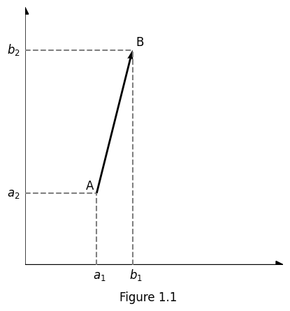
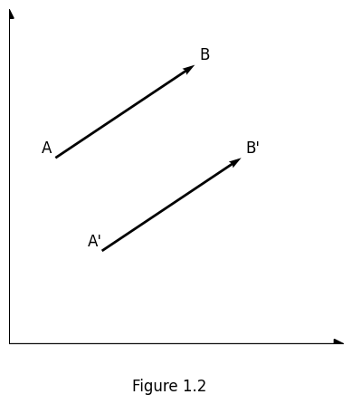
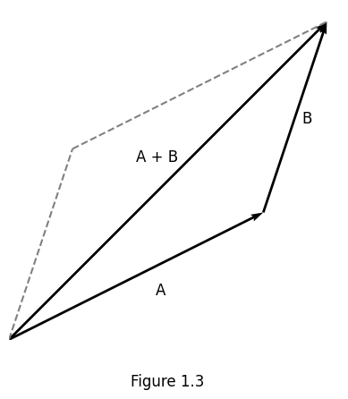
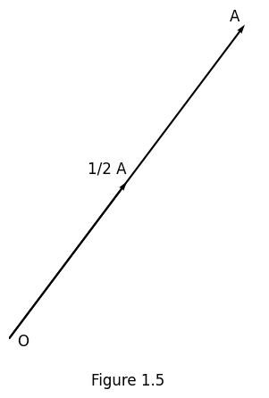
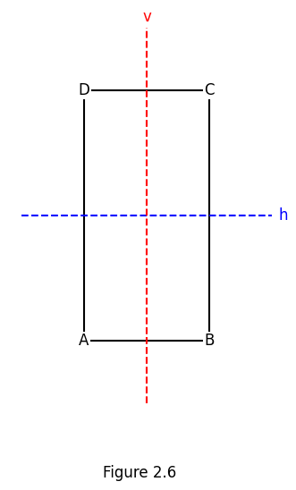
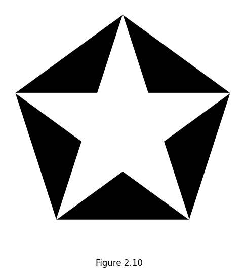

[toc]

---

# Vectors and Transformations in Plane Geometry

Philippe Tondeur

University of Illinois at Urbana-Champaign

PUBLISH OR PERISH, INC. 1993

---

Copyright © 1993 by Philippe Tondeur

All Rights Reserved

No part of this book may be reproduced or transmitted in any form or by any means, electronic, mechanical, photocopying, recording, or otherwise, for any purpose other than the purchaser’s personal use without the written permission of the publisher.

---

## PREFACE

The first goal of this book is to explain the geometry of the plane by vector methods, in contrast to a synthetic approach. The vector approach is simple and direct. It represents a general method, while the synthetic approach has to many students the aspect of consisting of a multitude of flashes of insight. Each approach has its own charm.

The second goal is to introduce the student to the concept of transformation. This approach to geometry dates back to Felix Klein (1849-1925) and Sophus Lie (1842-1899). It gives concrete examples leading to an appreciation of the theory of groups, but does not require any previous knowledge of group theory.

Here is a summary of the contents. In Chapter 1 it is explained how one can do plane geometry by using vector methods. The axioms of geometry are embodied in the rules of calculations with vectors. The chapter begins with those rules, and ends with some geometrical facts proved via vector methods. The dominant idea in Chapter 2 is to look at all this from the point of view of groups of transformations. The group of dilatations is the group most appropriate for the choice of topics in Chapter 1. The discussion of the abstract group concept is followed by the examples of the dihedral groups, the symmetry groups of regular polygons. In Chapter 3 the notions of length and angle measurements are discussed in terms of a scalar product. In Chapter 4 we turn to the discussion of the group of isometries. The chapter ends with a classification of all finite groups of isometries. In Chapter 5 the link is made between linear maps and their representations by matrices. This is followed by solutions to the odd-numbered exercises.

The text has as prerequisites only high-school geometry and algebra. The typical student in this course at the University of Illinois is currently a Junior, frequently taking simultaneously a standard course in abstract algebra. For many undergraduate mathematics majors, this is the only geometry course they will take. The material can be covered comfortably in one semester. There are exercises throughout the text.

I am indebted to Mary-Elisabeth Hamstrom for many helpful comments on this text. Hilda Britt’s unwavering word processing over the years has greatly simplified my life. Thanks also to several classes of students of Math 303 at the University of Illinois for their interest in the preliminary versions of this text. Some funny aspects of my immigrant English might remain. I hope that it will amuse some readers and irritate few.

Philippe Tondeur

---

## Contents

### Chapter 1. Vectors in the Plane

1.1 Definition

1.2 Addition of vectors

1.3 Multiplication by a scalar

1.4 Formal calculations

1.5 Equations of a line

1.6 Parallelograms

1.7 Centroid of a triangle

1.8 Centroid of a finite point set

1.9 Centroid of the zeros of a complex polynomial

1.10 Centroid of mass-points

1.11 Barycentric coordinates

1.12 Theorems of Ceva and Menelaus

1.13 Theorems of Desargues and Pappus

### Chapter 2. Translations, Dilatatations, Groups and Symmetries

2.1 Translations

2.2 Central dilatations

2.3 Central Reflections

2.4 Dilatations

2.5 Groups of transformations

2.6 Abstract groups

2.7 Symmetries of a rectangle

2.8 Symmetries of a square

2.9 Symmetries of an equilateral triangle

2.10 Dinedral groups

### Chapter 3. Scalar Product

TODO

---

## Chapter 1. Vectors in the Plane

In this chapter we define vectors in the plane and discuss the rules of calculations. This is used to prove some simple geometric facts about planar figures. The axioms of geometry are embedded in the rules of calculations with vectors, and this chapter begins with these rules. All the properties considered in this chapter concern “affine geometry”. The meaning of this concept will become clearer as we go through Chapter 1. The main point of this vector approach to geometry in contrast to the “analytic geometry” approach via coordinates is its simplicity when we try to prove facts about plane geometry.

### 1.1 Definitions.

The position of a point $A$ in the plane is characterized by two numbers $(a_{1}, a_{2})$, its Cartesian coordinates with respect to a pair of orthogonal (perpendicular) lines. If $A = (a_{1}, a_{2})$ and $B = (b_{1}, b_{2})$ are two points, the vector $\vec{AB}$ is given by
$$
\vec{AB} = (b_{1} - a_{1}, b_{2} - a_{2}). \quad (1)
$$

We visualize this as an arrow from $A$ (the beginning point) to $B$ (the end point).

See Figure 1.1. The vector $\vec{AB}$ is said to be located at $A$.

Thus for $A = (a_{1}, a_{2}), A' = (a_{1}', a_{2}')$ and $B = (b_{1}, b_{2}), B' = (b_{1}', b_{2}')$ we define equality by
$$
\vec{AB} = \vec{A'B'} \quad \text{if and only if} \quad b_{1} - a_{1} = b_{1}' - a_{1}', \; b_{2} - a_{2} = b_{2}' - a_{2}'. \quad (2)
$$

Note that the beginning points A and A’ need not be the same. The intuitive meaning of $\vec{AB} = \vec{A'B'}$ is that these vectors are parallel and of the same magnitude or length. Their direction is the same. See Figure 1.2.

The point $O = (0, 0)$ is the intersection of the two orthogonal coordinate lines. The point $A$ can be identified with the vector $\vec{OA}$, since both are given by $(a_{1}, a_{2})$. Thus one can write $A$ instead of $\vec{OA}$. $O$ is called the zero vector or origin.

### 1.2 Addition of vectors.

Let $A = (a_{1}, a_{2})$ and $B = (b_{1}, b_{2})$ be two vectors. One defines a new vector $A + B$ by
$$
A + B = (a_{1} + b_{1}, a_{2} + b_{2}). \quad (3)
$$

This corresponds to the parallelogram construction in Figure 1.3. This operation of addition of vectors has the following properties:
$$
\begin{align*}
(A1) & \quad A + B = B + A \quad & \text{commutativity} \\
(A2) & \quad A + (B + C) = (A + B) + C \quad & \text{associativity} \\
(A3) & \quad O + A = A + O = A \quad & \text{identity} \\
(A4) & \quad A + (-A) = 0 \quad & \text{inverse}
\end{align*}
$$

In the last property, the vector $-A$ is given by $-A = (-a_{1}, -a_{2})$. These properties derive immediately from the definition (2). A simplifying definition is the convention
$$
A - B = A + (-B). \quad (4)
$$

$A - B$ is the vector one adds to $B$ to get $A$. This is illustrated in Figure 1.4. If vectors are identified with points, then the
$$
A - B = \vec{BA}. \quad (5)
$$

In particular,
$$
A - O = \vec{OA} = A. \quad (6)
$$

### 1.3 Multiplication by a scalar.

Let $A = (a_{1}, a_{2})$ be a vector and $r$ a real number (a scalar). One defines a new vector $r A$ by
$$
r A = (r a_{1}, r a_{2}). \quad (7)
$$

In Figure 1.5, $r = \frac{1}{2}$. Multiplying by $r$ rescales the vector $A$.

### 2.5 Groups of Transformations

We have encountered several sets of bijections or transformations of the plane with the property that the composition of two transformations is again a transformation of the set, and the inverse of a transformation is a transformation of the set.

**DEFINITION.** A set $\mathscr{G}$ of transformations of a (non-empty) set $\mathscr{V}$ is a **group of transformations** if the following properties hold:

1. If $\alpha, \beta$ are in $\mathscr{G}$, then the composition $\beta \alpha$ is in $\mathscr{G}$.
2. If $\alpha$ is in $\mathscr{G}$, the inverse $\alpha^{-1}$ is in $\mathscr{G}$.

Note that $\alpha$ and $\alpha^{-1}$ in $\mathscr{G}$ implies that the identity transformation $1 = \alpha \alpha^{-1}$ is also in $\mathscr{G}$. The composition of transformations is naturally associative, i.e.,

$$(\gamma \beta)\alpha = \gamma(\beta \alpha),$$

for both of these compositions have exactly the same effect.

If $\mathscr{V}$ denotes the points of the plane, then the set $\mathscr{T}$ of translations is a group. So is the set of central dilatations with the same center $C$. By Theorem 2.18, the set $\mathscr{D}$ of all dilatations is a group. Further, the set of all transformations of $\mathscr{V}$ is a group. On the other hand, the set of all central reflections is **not** a group (see Theorem 2.15).

If $\mathscr{V}$ is any set, the group of all transformations or bijections of $\mathscr{V}$ is also called the **group of permutations** of $\mathscr{V}$.

It is important to note that the composition $\beta \alpha$ of two transformations need not equal the composition $\alpha \beta$. A group $\mathscr{G}$ of transformations is **commutative** or **abelian** (named after the Norwegian mathematician N. H. Abel), if

$$\beta \alpha = \alpha \beta$$

for all $\alpha, \beta \in \mathscr{G}$. An example is the group of translations, or the group of central dilatations with the same center. The group $\mathscr{D}$ of all dilatations is **not** commutative, as we have seen earlier.

A property is said to be **invariant under a group** $\mathscr{G}$ of transformations if the property still holds after the transformations of $\mathscr{G}$ are applied. A geometric figure is **invariant under** $\mathscr{G}$ if it is mapped to itself by the transformations of $\mathscr{G}$.

A related concept is the concept of **equivalence under the transformations** of $\mathscr{G}$, to be defined as follows:

**DEFINITION.** Two figures $F_1, F_2$ in the plane are **related by a group** $\mathscr{G}$ of transformations if there exists a transformation $\alpha \in \mathscr{G}$ mapping $F_1$ into $F_2$, i.e.,

$$\alpha(F_1) = F_2.$$

In symbols, we write:

$$F_1 \sim F_2 \quad \text{with respect to } \mathscr{G},$$

or simply $F_1 \sim F_2$ (with $\mathscr{G}$ being tacitly understood).

This relation has the following property:

**Transitivity:** If $F_1 \sim F_2$ and $F_2 \sim F_3$, then $F_1 \sim F_3$.

The proof consists in the observation that if $\alpha(F_1) = F_2$ and $\beta(F_2) = F_3$ for some $\alpha, \beta \in \mathscr{G}$, then

$$(\beta \alpha)(F_1) = F_3,$$

with $\beta \alpha \in \mathscr{G}$.

**Symmetry:** If $F_1 \sim F_2$, then $F_2 \sim F_1$.

The proof consists in the fact that if $\alpha(F_1) = F_2$, then

$$\alpha^{-1}(F_2) = F_1$$

with $\alpha^{-1} \in \mathscr{G}$.

To this property is added the (seemingly trivial) property:

**Reflexivity:** $F_1 \sim F_1$

This is equivalent to stating that the identity transformation $1$ is in $\mathscr{G}$.

A relation with the properties of **transitivity**, **symmetry**, and **reflexivity** is called an **equivalence relation**. The important fact to recognize is that these properties correspond precisely to the properties defining a group of transformations. Instead of saying that two figures are "related by a group $\mathscr{G}$", we can say they are **equivalent under** $\mathscr{G}$.

Consider, for example, the group $\mathscr{D}_C$ of **central dilatations** with a fixed center $C$. Two figures $F_1$, $F_2$ are equivalent under $\mathscr{D}_C$ if

$$\delta_{C, r}(F_1) = F_2$$

for some $r \neq 0$. Then also:

$$F_1 = \delta_{C, 1/r}(F_2)$$

demonstrating the **symmetry** of the relation.

To mention the **reflexivity** property in such concrete contexts may seem overly pedantic, but it remains essential in the abstract formulation.

Equivalence under the group of **translations** $\mathscr{T}$ is so obvious as to be almost embarrassing to formulate in the group-theoretic context — but doing so is a useful exercise in understanding the terminology and structure.

Felix Klein formulated in his *Erlanger Programm* (1872) the following revolutionary idea:

> To each group of transformations of the plane corresponds a **geometry**.

Groups of transformations had been used in geometry before. The originality of Klein’s idea, developed with Sophus Lie, was to **reverse** the order: instead of geometry determining the transformations, the **group** itself becomes the primary object of study.

In this spirit:

- There is a **dilatational geometry** associated with the group $\mathscr{D}$ of all dilatations.
- There is a **translational geometry** associated with the group $\mathscr{T}$ of translations (though often considered too trivial to highlight).
- **Affine geometry**, as introduced in Chapter 1, is defined as the geometry associated with the group of **collineations** (bijections mapping lines to lines).
- **Euclidean geometry**, the topic of Chapter 4, is the geometry associated with the group of **isometries** of the plane.

This point of view has proven extremely fruitful not only in **geometry**, but also in **other branches of mathematics** and even in **physics**. For instance:

> The group of transformations mapping solutions of an equation to other solutions is an essential object associated with that equation.

**Example:** In **atomic physics**, the regularities observed in the periodic table are a direct consequence of atomic models that are **invariant under (spatial) rotations**.

The idea of **symmetry** is closely related to the idea of **equivalence under the transformations of a group**.

Usually, the **symmetries of a figure** are the transformations that leave the figure **invariant**. These transformations form a **group of transformations**.

If we identify figures that are equivalent under a group $\mathscr{G}$—as we often do subconsciously—then the transformations in $\mathscr{G}$ become the **symmetries of the (equivalence class of) figures**. In this sense, the ideas of **symmetry** and **groups of transformations** are essentially identical.

Note that the properties of **transitivity**, **symmetry**, and **reflexivity** are automatically associated with the concept of symmetry.

A delightful book explaining the ideas of symmetry and transformation groups to a wider audience is:

> **"Symmetry"** by *Hermann Weyl*, Princeton University Press (1952)

### 2.6 Abstract Groups

It has proven fruitful to **abstract** the properties characterizing a group of transformations and use them to define a **group** in a way that does **not depend** on transformations or geometry. In such an abstract definition, the elements of the group need **not** be transformations at all.

- For two transformations, composition is well-defined.
- For two numbers, composition might be **addition** or **multiplication**.
- In general, we simply **postulate** a composition operation.

This leads to the concept of an **(abstract) group**.

**DEFINITION.** A **group** $\mathscr{G}$ is a (non-empty) set in which there is a defined **rule of composition**, denoted $XY$ or $X \cdot Y$, for elements $X$ and $Y$ in $\mathscr{G}$ (where $XY$ is again an element of $\mathscr{G}$), satisfying the following properties:

- **(G1) Identity:**
  There exists an element $E \in \mathscr{G}$, called the **identity**, such that
  $$EX = XE = X \quad \text{for all } X \in \mathscr{G}.$$

- **(G2) Inverses:**
  For every $X \in \mathscr{G}$, there exists an element $X^{-1} \in \mathscr{G}$, called the **inverse** of $X$, such that
  $$X^{-1}X = XX^{-1} = E.$$

- **(G3) Associativity:**
  For all $X, Y, Z \in \mathscr{G}$,
  $$X(YZ) = (XY)Z.$$

If $\mathscr{G}$ is a group of transformations, the composition rule is the **composition of transformations**.

A group $\mathscr{G}$ is **commutative** or **abelian** if:

$$XY = YX \quad \text{for all } X, Y \in \mathscr{G}.$$

Here are a few examples of commutative groups.
- **$(\mathbb{R}, +)$**: the real numbers with addition as the operation, and identity element $0$.
- **$(\mathbb{R}^\times, \cdot)$**: the nonzero real numbers under multiplication, with identity $1$.
- **$\mathscr{V}$**: the set of all vectors in the plane under vector addition.
- **$\mathscr{T}$**: the group of all **translations** of the plane is a group that is **abstractly similar** to $\mathscr{V}$.

---

**EXERCISE 2.15**

Let $\mathscr{G}$ be a group. Prove that if there are two elements $E$ and $E'$ both satisfying the identity property (G1), then:

$$E = E'.$$

This justifies referring to **the** identity of a group $\mathscr{G}$. Note that for a group of transformations this nitpicking is not necessary.

---

**EXERCISE 2.16**

Let $\mathscr{G}$ be a group. Assume that for some $X \in \mathscr{G}$ there are two elements $Y$ and $Y'$ satisfying:

$$
YX = XY = E \quad \text{and} \quad Y'X = XY' = E.
$$

Prove that $Y = Y'$.
*This justifies speaking of **the** inverse $X^{-1}$ of an element $X$ in $\mathscr{G}$.*

---

**EXERCISE 2.17**

Let $\mathscr{G}$ be a group.

1. Prove that for any $X \in \mathscr{G}$,
   $$
   \left(X^{-1}\right)^{-1} = X.
   $$
2. Prove that for any $X, Y \in \mathscr{G}$,
   $$
   (XY)^{-1} = Y^{-1}X^{-1}.
   $$

---

**EXERCISE 2.18**

Let $\mathbb{Z}_2 = \{0, 1\}$. Define the composition rule as:

- $0 + 0 = 0$
- $0 + 1 = 1$
- $1 + 0 = 1$
- $1 + 1 = 0$

Show that $(\mathbb{Z}_2, +)$ is a group with **0** as the identity element.

**Question:** Which element is the **inverse** of 1?

---

The example in Exercise 2.18 generalizes to arbitrary $n$. Let:

$$
\mathbb{Z}_n = \{0, 1, 2, \dots, n-1\}
$$

The composition rule is **addition modulo $n$**, denoted by the table in **Figure 2.4**.

Figure 2.4 – Addition Modulo $n$

| +     | 0     | 1     | 2     | ... | $n-2$ | $n-1$ |
|-------|-------|-------|-------|-----|--------|--------|
| **0** | 0     | 1     | 2     | ... | $n-2$ | $n-1$ |
| **1** | 1     | 2     | 3     | ... | $n-1$ | 0     |
| **2** | 2     | 3     | 4     | ... | 0     | 1     |
| **...** | ... | ... | ... | ... | ... | ... |
| **$n-1$** | $n-1$ | 0 | 1 | ... | $n-3$ | $n-2$ |

This group is called:

- The **group of residues left after devision by $n$**, or
- The **group of integers mod $n$**. (read this as "modulo $n$")

It is a **commutative group** with **0** as the identity element.

Each row and column contains each element of $\mathbb{Z}_n$ **exactly once**.

> Example: The inverse of $2$ in $\mathbb{Z}_n$ is $n - 2$, since:
> $$2 + (n - 2) \equiv 0 \pmod{n}$$

A **finite group** $\mathscr{G}$ is a group with a **finite number of elements**.

- For finite groups, the composition rule can be given in tabular form.
- This table is known as the **Cayley table** of the group.

> Only for **very small groups** is this approach practical.

The **powers** of an element $X$ in a group $\mathscr{G}$ are defined as:

$$
X^n = \underbrace{X \cdot X \cdot \dots \cdot X}_{n \text{ times}}, \quad \text{for } n \in \mathbb{Z}^+.
$$

In particular:

$$
X^1 = X
$$

For $n = 0$, we define:

$$
X^0 = E
$$

And for $m < 0$, we define:

$$
X^m = \left(X^{-1}\right)^{-m}
$$

With these conventions, we have the following **formulas**:

- **(37)** $X^m \cdot X^n = X^{m+n}$
- **(38)** $\left(X^m\right)^n = X^{mn}$

---

**EXERCISE 2.19**

Prove formulas (37) and (38) by **mathematical induction**.

---

**PROPOSITION 2.19**

Let $\mathscr{G}$ be a group and let $A, B \in \mathscr{G}$.

1. The equation $AX = B$ has a **unique solution** $X$.
2. The equation $YA = B$ has a **unique solution** $Y$.

**Proof:**

1. Multiply both sides of $AX = B$ on the **left** by $A^{-1}$:
   $$
   A^{-1}(AX) = A^{-1}B \Rightarrow X = A^{-1}B.
   $$
   This proves both **existence** and **uniqueness** of the solution.

2. Multiply both sides of $YA = B$ on the **right** by $A^{-1}$:
   $$
   (YA)A^{-1} = BA^{-1} \Rightarrow Y = BA^{-1}.
   $$
   Again, we get **existence** and **uniqueness**.

---

**PROPOSITION 2.20** – Cancellation Rules

Let $\mathscr{G}$ be a group.

1. If $AX = AX'$, then $X = X'$.
2. If $YA = Y'A$, then $Y = Y'$.

**Proof:**

1. Multiply both sides on the **left** by $A^{-1}$:
   $$
   A^{-1}(AX) = A^{-1}(AX') \Rightarrow X = X'
   $$

2. Multiply both sides on the **right** by $A^{-1}$:
   $$
   (YA)A^{-1} = (Y'A)A^{-1} \Rightarrow Y = Y'
   $$

---

**PROPOSITION 2.21** – Cayley Table and Uniqueness

Every element of a finite group occurs **exactly once** in every **row** and **exactly once** in every **column** of its **multiplication table**.

An illustration of this fact in a special case is given in **Figure 2.4** (addition modulo $n$).

---

**Subgroups**

When a subset $\mathscr{H}$ of a group $\mathscr{G}$ has the property that the **composition rule** in $\mathscr{G}$ turns $\mathscr{H}$ itself into a group, then $\mathscr{H}$ is called a **subgroup** of $\mathscr{G}$.

- $\mathscr{H}$ is a **proper subgroup** if $\mathscr{H} \ne \mathscr{G}$.
- The **trivial subgroup** is $\{E\}$, containing only the identity element.

---

**Cyclic Subgroups**

The **smallest subgroup** containing a given element $X$ is denoted **$\langle X \rangle$**, and is said to be **generated by $X$**.

- Such subgroups are called **cyclic**.
- The **order** of an element $X$ in $\mathscr{G}$ is the **least positive integer** $n$ such that:

  $$
  X^n = E.
  $$

- If **no such $n$ exists**, then $\langle X \rangle$ is said to be **infinite cyclic**.
- Otherwise, $\langle X \rangle$ is said to be **finite cyclic of order $n$**.
- The number of elements of $\langle X \rangle$ is **precisely $n$**.

The **order of a (finite) group** is the **number of its elements**.

> To examine a group, it is often fruitful to examine its **cyclic subgroups**.

---

**EXERCISES**

- **Exercise 2.20**
  Prove that a subgroup $\mathscr{H} \subset \mathscr{G}$ containing $X$ also contains the **cyclic subgroup $\langle X \rangle$** generated by $X$.

- **Exercise 2.21**
  Prove that the group $\mathbb{Z}_n$ (as defined by Figure 2.4) is **cyclic of order $n$**, and is **generated by 1**.

- **Exercise 2.22**
  Let $n = 5$. Prove that **every element** of $\mathbb{Z}_5$ different from 0 generates $\mathbb{Z}_5$.
  What is the situation for $\mathbb{Z}_6$?

- **Exercise 2.23**
  Compare the **orders** of $X$ and $X^{-1}$ in a group $\mathscr{G}$.

---

**When Are Two Groups the Same?**

Consider **Figure 2.5**:

Figure 2.5 – Two Group Tables

**Left: Addition Table of $\mathbb{Z}_2$**

| + | 0 | 1 |
|---|---|---|
| 0 | 0 | 1 |
| 1 | 1 | 0 |

**Right: Composition Table of Reflections**

| $\circ$ | $1$ | $\sigma$ |
|---------|-----|----------|
| $1$     | $1$ | $\sigma$ |
| $\sigma$| $\sigma$ | $1$ |

On the **left**: the **additive group** $\mathbb{Z}_2$.

On the **right**: the **transformation group** of the plane generated by the **central reflection $\sigma$** at the origin.

If:

- $0 \leftrightarrow 1$ (identity transformation)
- $1 \leftrightarrow \sigma$ (reflection)

Then **addition** on the left corresponds to **composition** on the right. These two groups are thus **(abstractly) the same**.

---

**Group Isomorphism**

Two groups $\mathscr{G}$ and $\mathscr{H}$ are **isomorphic** if there exists a **one-to-one correspondence** between their elements such that the **compositions correspond** under this mapping.

Formally, there exists a map:

$$
f : \mathscr{G} \to \mathscr{H}
$$

such that:

$$
f(XY) = f(X)f(Y), \quad \text{for all } X, Y \in \mathscr{G}.
$$

The function $f$ is called an **isomorphism**.
If such an isomorphism exists, $\mathscr{G}$ and $\mathscr{H}$ are said to be **isomorphic groups**, and are considered the **same abstract group**.

> Example: $\mathbb{Z}_2$ and the reflection group in Figure 2.5 are **isomorphic**.

---

- **Exercise 2.24**
  Prove that **any group with two elements** is **isomorphic to $\mathbb{Z}_2$**.

- **Exercise 2.25**
  Prove that **any group with three elements** is **isomorphic to $\mathbb{Z}_3$**.

---

### 2.7 Symmetries of a Rectangle

It is convenient to use the following notation for a **permutation** $\sigma$ of a finite set $\Gamma$, e.g., $\Gamma = \{A, B, C, D\}$. One writes:

$$
\sigma =
\begin{pmatrix}
A & B & C & D \\
\sigma(A) & \sigma(B) & \sigma(C) & \sigma(D)
\end{pmatrix}
$$

Since $\sigma$ is a **permutation**, the second row contains each element of $\Gamma$ **exactly once**.

---

**Reflections and Symmetries of a Rectangle**

We consider a **rectangle** with vertices $A, B, C, D$ and **symmetry axes** $h$ (horizontal) and $v$ (vertical), as in **Figure 2.6**.

**Horizontal Reflection** ($\sigma_h$)

The reflection over the horizontal axis $h$ is represented by:

$$
\sigma_{h} =
\begin{pmatrix}
A & B & C & D \\
D & C & B & A
\end{pmatrix}
$$

Note that $\sigma_h^2 = 1$ (identity), so $\sigma_h$ is an **involution**.

**Vertical Reflection** ($\sigma_v$)

The reflection over the vertical axis $v$ is represented by:

$$
\sigma_{v} =
\begin{pmatrix}
A & B & C & D \\
B & A & D & C
\end{pmatrix}
$$

Again, $\sigma_v^2 = 1$, so $\sigma_v$ is an involution.

**Central Reflection** ($\sigma$)

The **central reflection** through the center $O$ (intersection of $h$ and $v$) is given by:

$$
\sigma =
\begin{pmatrix}
A & B & C & D \\
C & D & A & B
\end{pmatrix}
$$

This is also an involution: $\sigma^2 = 1$.

---

The Klein Four-Group ($V_4$)

Let:

$$
V_4 = \{1, \sigma, \sigma_h, \sigma_v\}
$$

This forms a group called the **Klein four-group**, fully described by the multiplication table in **Figure 2.7**.

**Figure 2.7** – Multiplication Table for $V_4$

| $\cdot$       | $1$       | $\sigma$   | $\sigma_h$   | $\sigma_v$   |
|---------------|-----------|------------|---------------|---------------|
| $1$           | $1$       | $\sigma$   | $\sigma_h$    | $\sigma_v$    |
| $\sigma$      | $\sigma$  | $1$        | $\sigma_v$    | $\sigma_h$    |
| $\sigma_h$    | $\sigma_h$| $\sigma_v$ | $1$           | $\sigma$      |
| $\sigma_v$    | $\sigma_v$| $\sigma_h$ | $\sigma$      | $1$           |

This completes the multiplication table using the following equalities (derived from compositions):

- $\sigma_v \sigma_h = \sigma$
- $\sigma_h \sigma_v = \sigma$
- $\sigma \sigma_h = \sigma_v$
- $\sigma_h \sigma = \sigma_v$
- $\sigma \sigma_v = \sigma_h$
- $\sigma_v \sigma = \sigma_h$

**Incomplete Table** (Figure 2.7′)

| $\cdot$       | $1$       | $\sigma$   | $\sigma_h$   | $\sigma_v$   |
|---------------|-----------|------------|---------------|---------------|
| $1$           | $1$       | $\sigma$   | $\sigma_h$    | $\sigma_v$    |
| $\sigma$      | $\sigma$  | $1$        |               |               |
| $\sigma_h$    | $\sigma_h$|            | $1$           |               |
| $\sigma_v$    | $\sigma_v$|            |               | $1$           |

---

Group Properties in Context

To complete the multiplication table, we apply **Proposition 2.21** (each row and column contains every element exactly once):

- $\sigma_v \sigma_h = \sigma = \sigma_h \sigma_v$
- $\sigma \sigma_h = \sigma_v = \sigma_h \sigma$
- $\sigma \sigma_v = \sigma_h = \sigma_v \sigma$

---

Exercises

- **Exercise 2.26**
  Why are the groups $V_4$ and $\mathbb{Z}_4$ **not isomorphic**?

- **Exercise 2.27**
  Prove that **every group with four elements** is **isomorphic** to either $V_4$ or $\mathbb{Z}_4$.

---

### 2.8 Symmetries of a Square

Let $A$, $B$, $C$, $D$ denote the vertices of a **square**.

A **rotation** $\rho$ by $\frac{\pi}{2}$ (90° counterclockwise) is represented by:

$$
\rho =
\begin{pmatrix}
A & B & C & D \\
B & C & D & A
\end{pmatrix}
$$

Further powers of $\rho$ represent further rotations:

$$
\rho^{2} =
\begin{pmatrix}
A & B & C & D \\
C & D & A & B
\end{pmatrix}, \quad
\rho^{3} =
\begin{pmatrix}
A & B & C & D \\
D & A & B & C
\end{pmatrix}
$$

We have:

$$
\rho^{4} = 1
$$

Thus, $\rho$ **generates a cyclic group** $\langle \rho \rangle$ of **order 4**.

---

**Diagonal Symmetry**

Consider the reflection:

$$
\sigma =
\begin{pmatrix}
A & B & C & D \\
A & D & C & B
\end{pmatrix}
$$

This is a reflection across the diagonal $\overline{AC}$. Since $\sigma^2 = 1$, $\sigma$ is an **involution**.

We compute the compositions:

$\sigma \rho$:

$$
\sigma \rho =
\begin{pmatrix}
A & B & C & D \\
D & C & B & A
\end{pmatrix}
$$

$\sigma \rho^2$:

$$
\sigma \rho^2 =
\begin{pmatrix}
A & B & C & D \\
C & B & A & D
\end{pmatrix}
$$

$\sigma \rho^3$:

$$
\sigma \rho^3 =
\begin{pmatrix}
A & B & C & D \\
B & A & D & C
\end{pmatrix}
$$

These are also **involutions**, each corresponding to a **reflection in a different diagonal or axis**. In particular:

- $\sigma$ is reflection over $\overline{AC}$
- $\sigma \rho$ is reflection over $\overline{BD}$ (the other diagonal)
- $\sigma \rho^2$ and $\sigma \rho^3$ are reflections over the vertical and horizontal symmetry lines (you may verify which is which geometrically)

We also observe that:

**Key Identity**

$$
\sigma \rho = \rho^{-1} \sigma \tag{39}
$$

Since both sides yield:

$$
\begin{pmatrix}
A & B & C & D \\
D & C & B & A
\end{pmatrix}
$$

And:

$$
\rho^{-1} = \rho^3 \quad \text{(because } \rho^4 = 1\text{)}
$$

Thus, relation (39) becomes:

$$
\sigma \rho = \rho^3 \sigma
$$

This shows that:

$$
\sigma \rho^2 \ne \rho^2 \sigma
$$

Hence, the **group of symmetries of a square is not commutative**.

---

**The Dihedral Group** $D_4$

The group:

$$
D_4 = \{1, \rho, \rho^2, \rho^3, \sigma, \sigma \rho, \sigma \rho^2, \sigma \rho^3\}
$$

is called the **dihedral group** of **order 8**. The subscript 4 indicates the order of $\rho$.

---

**PROPOSITION 2.22**

The multiplication table of $D_4$ is completely determined by the following **relations**:

- $\rho^4 = 1$
- $\sigma^2 = 1$
- $\sigma \rho = \rho^{-1} \sigma$

---

**Proof Outline**

Multiplying the third relation from the **left** by $\rho$:

$$
\rho (\sigma \rho) = \rho \rho^{-1} \sigma = \sigma
$$

Multiplying the same from the **right** by $\rho^{-1}$:

$$
(\sigma \rho) \rho^{-1} = \sigma \rho \rho^{-1} = \sigma
$$

Thus:

**Additional Identities**

- $\rho \sigma = \sigma \rho^3$
  $\quad\quad$→ $\rho^2 \sigma = \rho (\rho \sigma) = \rho (\sigma \rho^3) = (\rho \sigma) \rho^3 = \sigma \rho^2$
- $\rho^3 \sigma = \rho^{-1} \sigma = \sigma \rho$

Also:

- $\rho (\sigma \rho) = (\rho \sigma) \rho = \sigma$
- $\rho^2 (\sigma \rho) = (\rho^2 \sigma) \rho = \sigma \rho^3$
- $\rho^3 (\sigma \rho) = (\rho^3 \sigma) \rho = \sigma \rho^2$

Thus, these rules allow us to **complete the full multiplication table of $D_4$**, using:

- The above identities
- **Proposition 2.21** (each element appears exactly once per row and column)

---

### 2.9 Symmetries of an Equilateral Triangle

Let $A$, $B$, $C$ be the vertices of an **equilateral triangle**.

A **rotation** $\rho$ (by $120^\circ$ counterclockwise) and a **reflection** $\sigma$ (over the axis through vertex $A$ and the midpoint of $BC$) are given by:

$$
\rho =
\begin{pmatrix}
A & B & C \\
B & C & A
\end{pmatrix}, \quad
\sigma =
\begin{pmatrix}
A & B & C \\
A & C & B
\end{pmatrix}
$$

These satisfy the relations:

- $\rho^3 = 1$
- $\sigma^2 = 1$
- $\sigma \rho = \rho^{-1} \sigma$

---

**Verifying the Relation**

To prove $\sigma \rho = \rho^{-1} \sigma$, we verify that both are represented by:

$$
\begin{pmatrix}
A & B & C \\
C & B & A
\end{pmatrix}
$$

This confirms the identity:

$$
\sigma \rho = \rho^2 \sigma \quad (\text{since } \rho^{-1} = \rho^2)
$$

Note that:

$$
\rho^2 \sigma \ne \sigma \rho^2
$$

So the group is **not commutative**.

---

**Multiplication Table**

Below is the structure of the **dihedral group** of the equilateral triangle, often denoted $D_3$ or $D_6$ (since it has 6 elements).

**Figure 2.8**

| ⋅               | $1$    | $\rho$     | $\rho^2$   | $\rho^3$   | $\sigma$   | $\sigma \rho$ | $\sigma \rho^2$ | $\sigma \rho^3$ |
|------------------|--------|-------------|-------------|-------------|------------|----------------|------------------|-------------------|
| $1$              | $1$    | $\rho$     | $\rho^2$   | $\rho^3$         | $\sigma$   | $\sigma \rho$ | $\sigma \rho^2$ | $\sigma \rho^3$          |
| $\rho$           | $\rho$| $\rho^2$   | $\rho^3$        | $1$      | $\sigma \rho^3$ | $\sigma$ | $\sigma \rho$       | $\sigma \rho^2$     |
| $\rho^2$         | $\rho^2$ | $\rho^3$     | $1$     | $\rho$    | $\sigma \rho^2$ | $\sigma \rho^3$     | $\sigma$   | $\sigma \rho$   |
| $\rho^3$         | $\rho^3$    | $1$     | $\rho$   | $\rho^2$         | $\sigma \rho$   | $\sigma \rho^2$ | $\sigma \rho^3$ | $\sigma$          |
| $\sigma$         | $\sigma$ | $\sigma \rho$ | $\sigma \rho^2$ | $\sigma \rho^3$    | $1$        | $\rho$       | $\rho^2$         | $\rho^3$               |
| $\sigma \rho$    | $\sigma \rho$ | $\sigma \rho^2$ | $\sigma \rho^3$ | $\sigma$ | $\rho^3$     | $1$            | $\rho$       | $\rho^2$            |
| $\sigma \rho^2$  | $\sigma \rho^2$ | $\sigma\rho^3$ | $\sigma$ | $\sigma \rho$ | $\rho^2$   | $\rho^3$         | $1$            | $\rho$          |
| $\sigma \rho^3$  | $\sigma \rho^3$ | $\sigma$ | $\sigma \rho$ | $\sigma \rho^2$    | $\rho$        | $\rho^2$       | $\rho^3$         | $1$               |

---

**PROPOSITION 2.23**

The group $D_3 = \{1, \rho, \rho^2, \sigma, \sigma \rho, \sigma \rho^2\}$ is completely determined by the relations:

$$
\rho^3 = 1, \quad \sigma^2 = 1, \quad \sigma \rho = \rho^{-1} \sigma \tag{43}
$$

---

**Proof Outline**

From the identity:

$$
\sigma \rho = \rho^{-1} \sigma
$$

We get the equivalent forms:

- $\rho \sigma = \sigma \rho^2$
- $\rho^2 \sigma = \sigma \rho$

We compute:

- $\rho \sigma = \sigma \rho^2$
- $\rho^2 \sigma = \sigma \rho$

Thus:

- $\rho(\sigma \rho) = (\rho \sigma) \rho = \sigma$
- $\rho^2(\sigma \rho) = \sigma \rho^2 \rho = \sigma \rho^3 = \sigma$
- and so on.

Using these, together with **Proposition 2.21** (each element appears once per row and column), we can fully determine the **multiplication table**.

---

**Figure 2.9** – Multiplication Table for $D_3$

| ⋅               | $1$    | $\rho$     | $\rho^2$   | $\sigma$   | $\sigma \rho$ | $\sigma \rho^2$ |
|------------------|--------|-------------|-------------|------------|----------------|------------------|
| $1$              | $1$    | $\rho$     | $\rho^2$   | $\sigma$   | $\sigma \rho$ | $\sigma \rho^2$ |
| $\rho$           | $\rho$| $\rho^2$   | $1$        | $\sigma \rho^2$ | $\sigma$ | $\sigma \rho$       |
| $\rho^2$         | $\rho^2$ | $1$    | $\rho$     | $\sigma \rho$ | $\sigma \rho^2$ | $\sigma$  |
| $\sigma$         | $\sigma$ | $\sigma \rho$ | $\sigma \rho^2$ | $1$ | $\rho$ | $\rho^2$ |
| $\sigma \rho$    | $\sigma \rho$ | $\sigma \rho^2$ | $\sigma$ | $\rho^2$ | $1$ | $\rho$ |
| $\sigma \rho^2$  | $\sigma \rho^2$ | $\sigma$ | $\sigma \rho$ | $\rho$ | $\rho^2$ | $1$ |

---

### 2.10 Dihedral Groups

For every $n > 2$, the **dihedral group** $D_n$ is the group consisting of the elements:

$$
\{1, \rho, \dots, \rho^{n-1}, \sigma, \sigma \rho, \dots, \sigma \rho^{n-1} \}
$$

whose multiplication table is completely determined by the relations:

$$
\rho^n = 1, \quad \sigma^2 = 1, \quad \sigma \rho = \rho^{-1} \sigma \tag{44}
$$

---

**Special Case**: $n = 2$

For $n = 2$, we have:

$$
\rho^2 = 1, \quad \sigma^2 = 1, \quad \sigma \rho = \rho \sigma
$$

Hence, $D_2$ is **commutative**, and is **isomorphic** to the **Klein group** $V_4$.

---

**General Case**: $n > 2$

For $n > 2$, the **dihedral group** $D_n$ is **not commutative**.

- The subgroup $\mathscr{G} = \langle \rho \rangle$ of $D_n$ is a **cyclic subgroup** of order $n$.
- The full dihedral group $D_n$ has **order $2n$**.

---

**EXERCISES**

- **Exercise 2.28**
  What is the **symmetry group** of the **Chrysler logo** in **Figure 2.10**?

- **Exercise 2.29**
  What is the **symmetry group** of the **Chevrolet Celebrity wheel cover** in **Figure 2.11**?

---

**Summary of Chapter**

In this chapter, we examined **plane geometry** from the perspective of **groups of transformations**—this is the viewpoint introduced by **Felix Klein** in his **Erlanger Programm**:

> “There are as many geometries as there are groups.”

In retrospect, the **affine geometry** topics of Chapter 1 are now seen to be associated with the **group of collineations** of the plane.

In the remaining chapters, we move on to **Euclidean Geometry**, defined by the **group of motions** (also called **isometries**) of the plane.

But before that, we must first discuss how to **measure lengths and angles**.

---

## Chapter 3. Scalar Product

Up to now we have discussed geometry in general, and in particular affine geometry. In this chapter we consider Euclidean geometry, which is in addtion based on length and angle measurements. This is most conveniently done with the help of the scalar product.

---

### 3.1 Definition and Elementary Properties

Let $X = (x_1, x_2)$ and $Y = (y_1, y_2)$ be two vectors. Their scalar product is defined by

$$
X \cdot Y = x_1 y_1 + x_2 y_2.
$$

The length of $X$ is the positive square root

$$
\lvert X \rvert = \sqrt{X \cdot X} = \sqrt{x_1^2 + x_2^2}.
$$

The distance from $X$ to $Y$ is defined by

$$
d(X, Y) = \lvert X - Y \rvert.
$$

The scalar product has the following properties for vectors $X, Y, Z$ and $r$ a real number:

- **(SP1)** $X \cdot Y = Y \cdot X$
- **(SP2)** $(X + Y) \cdot Z = X \cdot Z + Y \cdot Z$
- **(SP3)** $(rX) \cdot Y = r(X \cdot Y)$
- **(SP4)** $X \cdot X \ge 0$, and $X \cdot X = 0$ if and only if $X = 0$.

**EXERCISE 3.1.** Verify the properties (SP1) to (SP4).

Properties (SP1) and (SP2) imply that

$$
X \cdot (Y + Z) = X \cdot Y + X \cdot Z.
$$

Properties (SP1) and (SP3) imply that

$$
X \cdot (rY) = r (X \cdot Y).
$$

(SP2), (SP3), and these relations express the linearity of $X \cdot Y$ viewed as a function of $X$ or a function of $Y$. Together, they are expressed by saying that the scalar product is **bilinear**. (SP1) says the scalar product is **symmetric**. (SP4) is the property of **positive definiteness** of the scalar product. In the calculations below only these properties of the scalar product will be used, and not the specific formula defining it in terms of the components of $X$ and $Y$.

For example, we evaluate by these rules:

$$
\begin{aligned}
(X + Y) \cdot (X + Y)
&= X \cdot (X + Y) + Y \cdot (X + Y) \\
&= X \cdot X + X \cdot Y + Y \cdot X + Y \cdot Y \\
&= \lvert X \rvert^2 + 2(X \cdot Y) + \lvert Y \rvert^2,
\end{aligned}
\tag{1}
$$

**EXERCISE 3.2.** Verify similarly that

$$
(X - Y) \cdot (X - Y)
= \lvert X \rvert^2 - 2(X \cdot Y) + \lvert Y \rvert^2.
\tag{2}
$$

Further, we have by the same argument:

$$
(X + Y) \cdot (X - Y)
= \lvert X \rvert^2 - \lvert Y \rvert^2.
\tag{3}
$$

Note that the scalar product is completely determined by the length function. This follows from (1), which implies

$$
X \cdot Y
= \tfrac{1}{2} \bigl(\lvert X + Y\rvert^2 - \lvert X\rvert^2 - \lvert Y\rvert^2\bigr).
\tag{4}
$$

The identities (1) and (2) add up to

$$
\lvert X + Y\rvert^2 + \lvert X - Y\rvert^2
= 2\bigl(\lvert X\rvert^2 + \lvert Y\rvert^2\bigr),
\tag{5}
$$

which is called the **parallelogram law**. The vectors $X + Y$ and $X - Y$ are diagonal vectors in the parallelogram $O, X, X+Y, Y$ in Figure 3.1.

---

**EXERCISE 3.3.** Prove that if two medians of a triangle are of equal length, then the triangle is isosceles. The calculations are simplified substantially if one assumes that the triangle is as in Figure 3.2, with one vertex at the origin.

---

### 3.2 Orthogonality

Two vectors $X, Y$ are said to be **orthogonal** (or **perpendicular**) if

$$
X \cdot Y = 0.
$$

For example, $E_1 = (1,0)$ and $E_2 = (0, 1)$ are orthogonal, since

$$
E_1 \cdot E_2 = 1 \cdot 0 + 0 \cdot 1 = 0.
$$

The vectors $X = (1, 1)$ and $Y = (-1, 1)$ are orthogonal, since

$$
X \cdot Y = -1 + 1 = 0.
$$

The vectors $X = (x_1, x_2)$ and $X' = (-x_2, x_1)$ are orthogonal, since

$$
X \cdot X' = -\,x_1 x_2 + x_2 x_1 = 0.
$$

**EXERCISE 3.4.** Prove that a vector $A$ which is orthogonal to **all** vectors is necessarily the vector $O$.

**EXERCISE 3.5.** Prove that for two non-zero orthogonal vectors $A$ and $B$, the line $\ell_{AB}$ does not contain $O$.

A **rhombus** is defined as a parallelogram with sides of equal length.

---

#### PROPOSITION 3.1

A parallelogram is a rhombus if and only if its diagonals are orthogonal.

**Proof:**
We can assume that the parallelogram is situated as in Figure 3.1 with vertices $O, X, X + Y, Y$. The vectors $X + Y$ and $X - Y$ are the diagonal vectors. The identity (3) proves that the diagonal vectors are orthogonal exactly when the sides of the parallelogram have equal length.

If the bisection point of the diagonals of a parallelogram is at the origin, the vertices are $A, B, -A, -B$ as in Figure 3.3. The vectors $2A$ and $2B$ are diagonal vectors, and the vectors $A - B$ and $A + B$ are sides of the parallelogram. By Proposition 3.1, the parallelogram is a rhombus exactly when

$$
A \cdot B = 0,
$$

which may clarify the definition of orthogonality.

---

The **perpendicular bisector** $n$ of the segment from $A$ to $B$ $(A \neq B)$ is the line $n$ perpendicular to $\ell_{AB}$ through the midpoint $M = \tfrac12(A + B)$ (see Figure 3.4). Consider, for any $X$, the parallelogram $A, X, B, Y$ with $Y - A = B - X$. By Proposition 3.1 this is a rhombus if and only if $\ell_{XY}$ and $\ell_{AB}$ are orthogonal. It follows that for a point $X$ we have

$$
X \in n
\quad\text{if and only if}\quad
\lvert X - A\rvert = \lvert X - B\rvert.
\tag{6}
$$

---

#### THEOREM 3.2

The perpendicular bisectors of the sides of a triangle are concurrent.

The point of concurrence is called the **circumcenter** $D$ of $\triangle ABC$. It is equidistant from the vertices $A, B, C$.

> **Circumcircle**  
> “Do not despair. Remember there is no triangle, however obtuse, but the circumference of some circle passes through its wretched vertices”.  
> &emsp;— *Samuel Beckett, Murphy*

**EXERCISE 3.6.** Prove Theorem 3.2.

---

#### THEOREM 3.3 (Theorem of Pythagoras)

The scalar product $X \cdot Y = 0$ if and only if

$$
\lvert Y - X \rvert^2 = \lvert X\rvert^2 + \lvert Y\rvert^2
\quad (\text{see Figure 3.5}).
$$

**Proof:**
By (2) we have

$$
\lvert Y - X\rvert^2
= \lvert Y\rvert^2 - 2\,Y \cdot X + \lvert X\rvert^2.
$$

The following facts have the same formal content (and proofs):

$$
\begin{aligned}
\lvert X + Y\rvert^2 &= \lvert X\rvert^2 + \lvert Y\rvert^2
&& \text{if and only if } X \cdot Y = 0, \\[6pt]
\lvert X - Y\rvert^2 &= \lvert X\rvert^2 + \lvert Y\rvert^2
&& \text{if and only if } X \cdot Y = 0, \\[6pt]
\lvert X + Y\rvert^2 &= \lvert X - Y\rvert^2
&& \text{if and only if } X \cdot Y = 0.
\end{aligned}
$$

A **rectangle** is a parallelogram with orthogonal sides. The last stated equivalence proves the following.

---

#### PROPOSITION 3.4

A parallelogram is a rectangle if and only if its diagonals are of equal length.

---

The **altitude** $\ell_{C}$ of the triangle $\triangle ABC$ through the vertex $C$ is the line $\ell_{C}$ perpendicular to $\ell_{AB}$, through $C$ (see Figure 3.6). Its intersection point $H_{C}$ with $\ell_{AB}$ is the foot of $\ell_{C}$. Similarly, we obtain the altitudes $\ell_{A}$ and $\ell_{B}$ with feet $H_{A}$ and $H_{B}$.

---

#### THEOREM 3.5

The altitudes of a triangle are concurrent.

The point of concurrence is called the **orthocenter** $H$ of $\triangle ABC$.

---

#### First proof of Theorem 3.5

This proof is based on the concurrence of the perpendicular bisectors (Theorem 3.2) and the proof idea in Exercise 2.7 of Chapter 2. Let $G$ be the centroid of $\triangle ABC$ and consider the dilatation $\delta_{G, -2}$. We look at Figure 2.8, but for $P = D$ (the circumcenter). In this case the lines $a', b', c'$ are the perpendicular bisectors of the sides of $\triangle ABC$. Since $\delta_{G, -2}(A') = A$, the line $a'$ is transformed by $\delta_{G, -2}$ into a line through $A$ parallel to $a'$, i.e., the altitude $\ell_{A}$. Thus $\delta_{G, -2}$ transforms the perpendicular bisectors into the altitudes. Since the perpendicular bisectors are concurrent, so are the altitudes.

Note that applying this argument to the dilation $\delta_{G, -\tfrac12}$ instead proves conversely that the concurrence of the altitudes implies the concurrence of the perpendicular bisectors.

---

#### Second proof of Theorem 3.5

This proof is based on the identity

$$
(X - A) \cdot (B - C) \;+\; (X - B) \cdot (C - A) \;+\; (X - C) \cdot (A - B)
\;=\; 0.
\tag{7}
$$

This identity holds for any $X$, and it follows from expanding the left-hand side and using the bilinearity of the scalar product.

Let now $H$ be the intersection point of the two altitudes $\ell_{A}$ and $\ell_{B}$. Note that

$$
H \in \ell_{A}
\;\;\Longrightarrow\;\;
(H - A) \cdot (B - C) = 0,
$$
$$
H \in \ell_{B}
\;\;\Longrightarrow\;\;
(H - B) \cdot (C - A) = 0.
$$

It follows from $(7)$ applied to $X = H$ that

$$
(H - C) \cdot (A - B) = 0.
$$

But this means $H \in \ell_{C}$. Hence $H$ lies on all three altitudes and they are concurrent.

---

#### Third proof of Theorem 3.5

We consider $\triangle ABC$ as the triangle of the midpoints of the sides of a triangle $\triangle A' B' C'$ as in Figure 3.7. The altitude $\ell_{C}$ of $\triangle ABC$ through $C$ is the perpendicular bisector of $\triangle A' B' C'$ through $C'$. Thus the orthocenter of $\triangle ABC$ and the circumcenter of $\triangle A'B'C'$ coincide.

The first proof of Theorem 3.5 given above shows that

$$
H \;=\; \delta_{G, -2}(D),
\tag{8}
$$

for the orthocenter $H$ and the circumcenter $D$. By formula (13) of Chapter 2 we have

$$
H \;=\; \delta_{G, -2}(D)
\;=\;
G \;-\; 2 \bigl(D - G\bigr)
\;=\;
3G \;-\; 2D.
\tag{9}
$$

This implies

$$
3\,\bigl(G - D\bigr)
\;=\;
H - D.
\tag{10}
$$

Both $(8)$ and $(10)$ show that $G$, $D$, and $H$ are collinear. This line is called the **Euler line** of $\triangle ABC$. There is one case where this line is not well-defined, namely when the three points coincide. This occurs for an **equilateral** triangle, where median, perpendicular bisector, and altitude are exactly the same line. Using $G = \tfrac{1}{3}(A+B+C)$ (from formula (15) of Chapter 1), we find from $(9)$ that

$$
H
\;=\;
A + B + C \;-\; 2D.
\tag{11}
$$

This formula is particularly simple if we choose the origin as circumcenter $D$. Then

$$
H
\;=\;
A + B + C.
\tag{12}
$$

The following Figure 3.8 illustrates the situation $(D = O)$. Here we have constructed rhombi $O A R B$, $O A Q C$, $O B P C$. Let $H$ be such that $\triangle Q H R$ is a rhombus. Then $P C Q H$ and $P B R H$ are also rhombi. Further,

$$
(H - A) \cdot (R - Q)
\;=\;
0
\quad
(\text{diagonals in a rhombus}),
$$

and $R - Q = B - C$. Thus

$$
(H - A) \cdot (B - C)
\;=\;
0.
$$

Similarly,

$$
(H - B) \cdot (C - A)
\;=\;
0,
\quad
(H - C) \cdot (A - B)
\;=\;
0,
$$

and $H$ is the orthocenter (see the second proof of Theorem 3.5). Note that $H$ clearly satisfies $(12)$ (it may help to interpret $H - O$ as a space diagonal in a parallelepiped, all projected to the plane).

It is further clear that for $\triangle PQR$ the roles of $O$ and $H$ are reversed: $O$ is its orthocenter and $H$ its circumcenter. (Make the above construction for $\triangle PQR$. You will end up with the same figure.) Thus the Euler lines of $\triangle ABC$ and $\triangle PQR$ are the same.

Another point on the Euler line is of interest. This is the midpoint $N$ of the interval connecting the circumcenter $D$ and the orthocenter $H$. If $D = O$ as above, then by $(12)$

$$
N
\;=\;
\tfrac{1}{2} \bigl(A + B + C\bigr).
\tag{13}
$$

It is the center of the *nine-point circle* discussed in the next section.

---

**EXERCISE 3.7.** For $\triangle ABC$ consider the midpoint $A''$ of $A$ and $H$, and the midpoint $B''$ of $B$ and $H$, where $H$ is the orthocenter. Let $A'$ and $B'$ be the midpoints of the sides of $\triangle ABC$ opposite $A$ and $B$. Prove that $A''B''A'B'$ is a rectangle.

---

### 3.3 Circles

The points of the circle with center $ D $ and radius $ r $ are characterized by
$$
|X - D| = r.
$$

**THEOREM 3.6 (Theorem of Thales).**
In $ \triangle ABC $, let $ \mathscr{C} $ be the circle with side $ AB $ as diameter. Then the angle at $ C $ is a right angle if and only if $ C $ is a point of the circle $ \mathscr{C} $ (see Figure 3.10).

**Proof:**
Let the origin $ O $ be the center of $ \mathscr{C} $. Then $ B = -A $. Thus,
$$
(C - A) \cdot (C - B) = (C - A) \cdot (C + A) = |C|^2 - |A|^2.
$$
The lines $ \ell_{AC} $ and $ \ell_{BC} $ are orthogonal if and only if the LHS equals zero. The RHS equals zero if and only if $ |C| = |A| $, i.e., if and only if $ C $ is a point of $ \mathscr{C} $.

---

**EXERCISE 3.8.**
Consider Figure 3.10 and complete it with the triangle $ \triangle ABD $ obtained from $ \triangle ABC $ by central reflection in the center of the circle. State a theorem in terms of the quadrilateral $ ADBC $.

---

**EXERCISE 3.9.**
For two points $ A \ne B $, let
$$
\mathscr{C}_r = \left\{ X \mid |X - A| = r |X - B| \right\} \quad \text{for } r > 0.
$$
For $ r = 1 $, these are precisely the points of the perpendicular bisector of $ \overline{AB} $.
Prove that for $ r \ne 1 $, $ \mathscr{C}_r $ is a circle.

---

**PROPOSITION 3.7.**
*The image of a circle under a dilatation is a circle.*

**Proof:**
Let $ \mathscr{C} $ be a circle with center $ D $ and radius $ r $. For a point $ X \in \mathscr{C} $, we have
$$
|X - D| = r.
$$
For a translation $ \tau_A $,
$$
|\tau_A(X) - \tau_A(D)| = |X - D| = r,
$$
which shows that the image of $ \mathscr{C} $ is the circle with center $ \tau_A(D) $ and the same radius.

For a central dilatation $ \delta_S $,
$$
|\delta_S(X) - \delta_S(D)| = |s(X - D)| = |s| \cdot |X - D| = |s| \cdot r,
$$
which shows that the image of $ \mathscr{C} $ is the circle with center $ \delta_S(D) $ and radius $ |s| \cdot r $.

For a composite dilatation $ \delta_{C,s} = \tau_C \circ \delta_S \circ \tau_C^{-1} $, a repeated application of these arguments shows that the image of $ \mathscr{C} $ is a circle.

---

**THEOREM 3.8 (Nine-Point Circle Theorem).**
Consider $ \triangle ABC $ with orthocenter $ H $, and the following nine points:

- Let $ A', B', C' $ be the midpoints of the sides opposite $ A, B, C $.
- Let
$$
A'' = \frac{1}{2}(A + H), \quad B'' = \frac{1}{2}(B + H), \quad C'' = \frac{1}{2}(C + H).
$$
- Let $ D, E, F $ be the feet of the altitudes from $ A, B, C $ respectively.

Then these nine points lie on a circle. Its center $ N $ lies on the Euler line and is the midpoint of the circumcenter and the orthocenter $ H $ of $ \triangle ABC $.

This circle is often called the **Euler circle** or the **Feuerbach circle**.

**Proof:**
Let $ G $ be the centroid of $ \triangle ABC $. The dilatation $ \delta = \delta_{C, -1/2} $ maps the circumcircle $ \mathscr{C}' $ through $ A, B, C $ into a circle $ \mathscr{C} $ by Proposition 3.7. Since $ \delta $ maps $ A, B, C $ to $ A', B', C' $, these points lie on $ \mathscr{C} $. It remains to show the other six points also lie on $ \mathscr{C} $.

Assume the circumcenter is at the origin. Then
$$
\delta(0) = \delta_{C, -1/2}(0) = \frac{3}{2}G = \frac{1}{2}(A + B + C).
$$
By the formula for centroid, this shows
$$
\delta(0) = N,
$$
for the prospective center of $ \mathscr{C} $. which means $ N $ is the midpoint of the origin (circumcenter) and $ H $.

For any line $ \ell $, the feet of the perpendiculars to $ \ell $ through 0 and $ H $ are equidistant from the midpoint $ N $. This can be shown using the Pythagorean theorem on the right triangles formed by projection through $ N $. Therefore,
$$
|A' - N| = |D - N|, \quad |B' - N| = |E - N|, \quad |C' - N| = |F - N|.
$$
Since $ A', B', C' \in \mathscr{C} $, so are $ D, E, F $.

Now consider the dilatation $ \gamma = \delta_{H, 1/2} $. Then
$$
\gamma(0) = \delta_{H, 1/2}(0) = \frac{1}{2} H = N,
$$
and the image of $ \mathscr{C}' $ under $ \gamma $ is a circle with center $ N $, and radius one-half the radius of $ \mathscr{C}' $. Thus it must coincide with $ \mathscr{C} $. Since $ \gamma $ maps $ A, B, C $ to $ A'', B'', C'' $, this completes the proof.

---

**EXERCISE 3.10.**
Use Exercise 3.7 and the Theorem of Thales to give another proof of the Nine-Point Circle Theorem.

---

### 3.4 Cauchy-Schwarz Inequality

This inequality states that for any two vectors $ X $ and $ Y $,
$$
(X \cdot Y)^2 \leq |X|^2 \cdot |Y|^2 \tag{14}
$$
Moreover, equality holds if and only if $ X = rY $ or $ Y = sX $.

**Proof:**
For any real number $ t $, we have:
$$
0 \leq |X + tY|^2 = |X|^2 + 2t(X \cdot Y) + t^2 |Y|^2 = P(t).
$$
If $ Y = 0 $, inequality (14) becomes an equality and $ Y = 0 \cdot X $. Thus we can assume $ Y \neq 0 $, so that $ P(t) $ is a quadratic polynomial in $ t $. Since $ P(t) \geq 0 $ for all $ t $, it follows that the discriminant must satisfy:
$$
(X \cdot Y)^2 - |X|^2 \cdot |Y|^2 \leq 0.
$$
(Think of the quadratic formula and the condition for a non-negative quadratic polynomial to have at most one real root.)

This proves inequality (14). Moreover, equality $ P(t_0) = 0 $ is achieved for exactly one $ t_0 $ when
$$
(X \cdot Y)^2 = |X|^2 \cdot |Y|^2,
$$
which implies that $ X + t_0 Y = 0 $, or $ X = -t_0 Y $. Geometrically, this means the line $ \ell_{XY} $ goes through the origin.

---

A consequence of (14) is the **triangle inequality**:
$$
|X + Y| \leq |X| + |Y| \tag{15}
$$
which, if $ X $ is replaced by $ X - Y $, leads to:
$$
|X - Y| \geq ||X| - |Y|| \tag{16}
$$

**Proof of (15):**
This follows from:
$$
\begin{aligned}
|X + Y|^2 &= |X|^2 + 2 (X \cdot Y) + |Y|^2 \\
&\leq |X|^2 + 2 |X| |Y| + |Y|^2 \\
&= (|X| + |Y|)^2,
\end{aligned}
$$
where we have used inequality (14).

The proof shows that equality holds in (15) if and only if
$$
X \cdot Y = |X| \cdot |Y|.
$$
This is the case if and only if $ X = rY $ or $ Y = sX $, with $ r > 0 $, $ s > 0 $, since $ |X| \cdot |Y| > 0 $. It follows that one of the two vectors $ X $, $ Y $ lies on the same ray from the origin as the other.

---

As noted at the beginning of this chapter, the **distance** between two points $ X $, $ Y $ is given by:
$$
d(X, Y) = |X - Y| = \sqrt{(X - Y) \cdot (X - Y)} \tag{17}
$$
(i.e., the positive square root). The distance satisfies the following three properties:

- **(D1)** $ d(X, Y) = d(Y, X) $
- **(D2)** $ d(X, Y) \geq 0 $; and $ d(X, Y) = 0 $ if and only if $ X = Y $
- **(D3)** $ d(X, Z) \leq d(X, Y) + d(Y, Z) $

In (D3), equality holds if and only if $ Y - Z = t(X - Y) $ for some $ t \geq 0 $, so that
$$
(1 + t)Y = tX + Z,
$$
which means $ Y $ lies on the line segment between $ X $ and $ Z $.

---

**EXERCISE 3.11.**
Prove (D3).

---

**EXERCISE 3.12.**
Let $ A, B, C, D $ be the vertices of a convex quadrilateral. Convexity means that for each of the lines $ \ell_{AB}, \ell_{BC}, \ell_{CD}, \ell_{DA} $, the quadrilateral lies entirely in one of its half-planes.
Find the point $ P $ for which the minimum
$$
\min \left( d(P, A) + d(P, B) + d(P, C) + d(P, D) \right)
$$
is realized.

---

### 3.5 Projection

We calculate the orthogonal projection of a vector $ Y $ onto the line defined by the nonzero vector $ X $ (see Figure 3.12). The projection vector $ \mathrm{proj}_X Y $ is a scalar multiple of $ X $:
$$
\mathrm{proj}_X Y = cX.
$$
The projection vector $ cX $ is characterized by the condition:
$$
(Y - cX) \cdot X = 0,
$$
or equivalently,
$$
Y \cdot X - c(X \cdot X) = 0,
$$
which leads to the equation:
$$
c = \frac{X \cdot Y}{|X|^2} \tag{18}
$$
and the formula:
$$
\mathrm{proj}_X Y = cX = \frac{X \cdot Y}{|X|^2} X \tag{19}
$$

The **length** of the projection vector is:
$$
|cX| = |c| \cdot |X| = \frac{|X \cdot Y|}{|X|} \tag{20}
$$

If $ X $ is a **unit vector**, i.e., $ |X| = 1 $, then:
$$
\mathrm{proj}_X Y = (X \cdot Y)X \tag{21}
$$
and
$$
|\mathrm{proj}_X Y| = |X \cdot Y| \tag{22}
$$

---

**Remark:**
An application of the Pythagorean theorem to the right triangle in Figure 3.12 yields:
$$
|cX|^2 + |Y - cX|^2 = |Y|^2.
$$
Multiplying by $ |X|^2 $ and using formula (18) gives:
$$
(X \cdot Y)^2 + |X|^2 \cdot |Y - cX|^2 = |X|^2 \cdot |Y|^2.
$$
Rewriting, we get:
$$
|X|^2 \cdot |Y - cX|^2 = |X|^2 \cdot |Y|^2 - (X \cdot Y)^2,
$$
which explains the **deficiency term** in the Cauchy-Schwarz inequality (14). The deficiency vanishes if and only if $ Y - cX = 0 $, i.e., $ Y $ lies on the line through the origin in the direction of $ X $.

---

**EXERCISE 3.13**
Let $ E_1 $ and $ E_2 $ be two orthogonal vectors of unit length. Prove that any vector $ X $ can be written as:
$$
X = (X \cdot E_1) E_1 + (X \cdot E_2) E_2.
$$

---

**EXERCISE 3.14**
Let $ \mathrm{area}(\triangle OXY) $ denote the area of the triangle $ \triangle OXY $ defined by the vectors $ X $ and $ Y $. Verify the formula:
$$
\mathrm{area}(\triangle OXY) = \frac{1}{2} \sqrt{|X|^2 |Y|^2 - (X \cdot Y)^2}.
$$

---

### 3.6 Angles

Let $ \alpha $ be the **oriented angle** between vectors $ X $ and $ Y $, denoted
$$
\alpha = \angle(X, Y).
$$
This means $ \alpha $ is **positive** if the vector $ X $ turns toward $ Y $ in the direction of **positive (counterclockwise)** orientation, as shown in Figure 3.12.

Then,
$$
\cos \alpha = \frac{X \cdot Y}{|X||Y|} \tag{23}
$$

**Proof:**
From Figure 3.12 and formula (18),
$$
\cos \alpha = \frac{c|X|}{|Y|} = \frac{X \cdot Y}{|X||Y|}.
$$
This argument holds clearly for angles $ -\frac{\pi}{2} < \alpha < \frac{\pi}{2} $. For other angles, formula (23) still yields the correct sign.

---

The main consequence of (23) is:

**COROLLARY 3.9.**
*The angles in plane geometry are completely determined by the scalar product (up to sign).*

Note that by formula (4), the scalar product is itself expressible in terms of **vector lengths**. Thus, we can restate this:

> *Angles in plane geometry are completely determined by vector lengths (up to sign).*

---

**EXERCISE 3.15**
Let $ \mathrm{area}(\triangle OXY) $ denote the area of the triangle $ \triangle OXY $ defined by vectors $ X $ and $ Y $. Verify the formula:
$$
\mathrm{area}(\triangle OXY) = \frac{1}{2} |X||Y| \cdot |\sin \angle(X, Y)|.
$$

---

**Remark:**
To determine the **sign** of $ \angle(X, Y) $, more information is needed beyond (23).
If $ X = (x_1, x_2) $ and $ Y = (y_1, y_2) $, then:
$$
\det(X, Y) = \begin{vmatrix}
x_1 & x_2 \\
y_1 & y_2
\end{vmatrix} = x_1 y_2 - x_2 y_1
$$
- $ \det(X, Y) > 0 $ if $ 0 < \angle(X, Y) < \pi $
- $ \det(X, Y) < 0 $ if $ -\pi < \angle(X, Y) < 0 $
- $ \det(X, Y) = 0 $ corresponds to $ \angle(X, Y) = 0 $ or $ \pi $

The proof uses the fact that:
$$
|\det(X, Y)| = \text{area}(X, Y),
$$
where this area is that of the **parallelogram** defined by $ X $ and $ Y $.
Using Exercise 3.14:
$$
\text{area}(X, Y) = \sqrt{|X|^2 |Y|^2 - (X \cdot Y)^2}.
$$
For $ X = (x_1, x_2) $, $ Y = (y_1, y_2) $, this becomes:
$$
\text{area}(X, Y) = \sqrt{(x_1 y_2 - x_2 y_1)^2} = |x_1 y_2 - x_2 y_1|.
$$

---

Another consequence of (23) is the **Law of Cosines**, which states that for nonzero vectors $ X $ and $ Y $:
$$
|X - Y|^2 = |X|^2 + |Y|^2 - 2|X||Y| \cos \angle(X, Y) \tag{24}
$$

**Proof:**
This follows directly from expanding:
$$
|X - Y|^2 = |X|^2 + |Y|^2 - 2(X \cdot Y),
$$
and then applying formula (23).

Note: For orthogonal vectors $ X \perp Y $, this reduces to the **Pythagorean Theorem**.

---

**EXERCISE 3.16**
The area of the triangle $ \triangle OXY $, defined by vectors $ X $ and $ Y $, is given by **Heron's Formula**:
$$
\mathrm{area}(\triangle OXY) = \sqrt{s(s - a)(s - b)(s - c)},
$$
where:
- $ a = |X| $,
- $ b = |Y| $,
- $ c = |Y - X| $,
- $ s = \frac{1}{2}(a + b + c) $ is the **semi-perimeter**.

---

### 3.7 Equation of a Line

What is the equation of a line $ \ell $ passing through a point $ P $ and orthogonal to a given vector $ N \ne 0 $, as shown in Figure 3.13?

A point $ X \in \ell $ if and only if:
$$
(X - P) \cdot N = 0 \tag{25}
$$

This is equivalently expressed as:
$$
X \cdot N = P \cdot N \tag{26}
$$

---

**EXERCISE 3.17**
Let $ X = (x_1, x_2) $, $ P = (p_1, p_2) $, and $ N = (n_1, n_2) $.
Write out equation (26) in a familiar form.

---

**EXERCISE 3.18**
Let $ \ell $ be orthogonal to $ N $, and $ \ell' $ orthogonal to $ N' $.
What is the condition for $ \ell $ and $ \ell' $ to be orthogonal?

---

**Summary:**
In this chapter, we discussed **length** and **angle** measurements as defined via the **scalar product**. In the next chapter, we return to the **transformation** perspective introduced in Chapter 2, and apply it to **Euclidean Geometry**.

---

## Chapter 4 ISOMETRIES

We consider now transformations preserving length and angle measurements. These are called isometries. Euclidean geometry studies properties invariant under isometries. The main result of this chapter is a description of the group of isometries in terms of reflections. The chapter concludes with a discussion of all possible finite group of isometries.

### 4.1 Definition and Examples

An **isometry** is a distance-preserving map.
That is, a map $ \alpha $ of the plane to itself is an isometry if:
$$
d(\alpha(X), \alpha(Y)) = d(X, Y) \quad \text{for all } X, Y.
$$

---

**PROPOSITION 4.1.** *Translations are isometries.*

**Proof:**
Let $ \tau_A $ be a translation. Then:
$$
d(\tau_A(X), \tau_A(Y)) = |\tau_A(X) - \tau_A(Y)| = |(A + X) - (A + Y)| = |X - Y| = d(X, Y).
$$

For a **central dilatation** $ \delta_r $, we have:
$$
d(\delta_r(X), \delta_r(Y)) = |\delta_r(X) - \delta_r(Y)| = |rX - rY| = |r||X - Y| = |r| \cdot d(X, Y).
$$
Thus, distances are scaled by $ |r| $, and $ \delta_r $ is not an isometry unless $ r = \pm 1 $.

---

**PROPOSITION 4.2.** *The composition of two isometries is an isometry.*

**Proof:**
Let $ \alpha $ and $ \beta $ be isometries. Then for all $ X, Y $,
$$
d(X, Y) = d(\alpha(X), \alpha(Y)) = d(\beta(\alpha(X)), \beta(\alpha(Y))),
$$
which proves $ \beta \circ \alpha $ is an isometry.

---

We will later prove that:
- Every isometry has an inverse (**Theorem 4.6**),
- The inverse is also an isometry (**Theorem 4.7**),
- Therefore, isometries form a group (**Theorem 4.8**).

To prepare, consider:
Let $ \alpha $ be an isometry and $ A = \alpha(0) $. Define $ \beta = \tau_A^{-1} \circ \alpha $.
Then $ \beta $ is also an isometry (by Proposition 4.2), and:
$$
\beta(0) = (\tau_A^{-1} \circ \alpha)(0) = \tau_A^{-1}(A) = A - A = 0.
$$
Thus, any isometry $ \alpha $ can be written as:
$$
\alpha = \tau_A \circ \beta \tag{1}
$$
where $ \beta $ is an isometry with $ \beta(0) = 0 $.

---

**THEOREM 4.3.** *Let $ \alpha $ be an isometry satisfying $ \alpha(0) = 0 $. Then:*

1. $ \alpha(X + Y) = \alpha(X) + \alpha(Y) $ (additivity)
2. $ \alpha(rX) = r\alpha(X) $ (homogeneity)

> These properties mean that $ \alpha $ is a **linear map**.

**Proof:**

First, show $ |\alpha(X)| = |X| $ for all $ X $:
$$
|\alpha(X)| = |\alpha(X) - \alpha(0)| = d(\alpha(X), \alpha(0)) = d(X, 0) = |X|.
\tag{2}
$$

Next, prove that $ \alpha $ preserves scalar products:
$$
\alpha(X) \cdot \alpha(Y) = X \cdot Y. \tag{3}
$$

Compare:
$$
d(\alpha(X), \alpha(Y))^{2} = |\alpha(X) - \alpha(Y)|^2 = |\alpha(X)|^2 - 2\alpha(X) \cdot \alpha(Y) + |\alpha(Y)|^2,
$$
with:
$$
|X - Y|^2 = |X|^2 - 2X \cdot Y + |Y|^2,
$$
and apply (2) to conclude (3).

To prove **additivity** (i):

Evaluate:
$$
|\alpha(X + Y) - (\alpha(X) + \alpha(Y))|^2 = 0
$$
(using properties (2) and (3)), which implies:
$$
\alpha(X + Y) = \alpha(X) + \alpha(Y).
$$

To prove **homogeneity** (ii):

$$
|\alpha(rX) - r\alpha(X)|^2 = |\alpha(rX)|^2 - 2r\alpha(rX) \cdot \alpha(X) + r^2|\alpha(X)|^2
$$
$$
= |rX|^2 - 2r(rX \cdot X) + r^2|X|^2 = 0,
$$
which implies:
$$
\alpha(rX) = r\alpha(X).
$$

---

**EXERCISE 4.1.**
Prove that any isometry $ \alpha $ preserves angles up to sign:
$$
\angle(\alpha(X), \alpha(Y)) = \pm \angle(X, Y).
$$

---

**THEOREM 4.4.** *An isometry maps lines to lines.*

A map with this property is called a **collineation**.
Translations and central dilatations are examples of collineations.

**Proof:**

- For a linear isometry:
  $$
  \alpha(aA + bB) = a\alpha(A) + b\alpha(B),
  $$
  which shows that points on line $ \ell_{AB} $ are mapped to points on line $ \ell_{\alpha(A)\alpha(B)} $.

- For a translation $ \tau_A $, the property follows from Proposition 2.4.

Thus, any isometry $ \alpha = \tau_A \circ \beta $ (from equation 1) maps lines to lines.

---

**COROLLARY 4.5.**
An isometry maps parallel lines to parallel lines.

**Proof:**
This follows from Theorem 4.4 and the angle preservation (up to sign) from Exercise 4.1.

---

**THEOREM 4.6.** *An isometry is a bijection.*

**Proof:**

- **Injectivity:**
  Assume $ \alpha(X) = \alpha(Y) $. Then:
  $$
  d(\alpha(X), \alpha(Y)) = 0 \Rightarrow d(X, Y) = 0 \Rightarrow X = Y.
  $$

- **Surjectivity:**
  It's enough to prove for linear isometries (translations are bijective).
  Let $ m $ and $ n $ be orthogonal lines through the origin. Then $ \alpha(m) $, $ \alpha(n) $ are also orthogonal.
  Any point $ Q \in \mathbb{R}^2 $ can be written as:
  $$
  Q = a\alpha(X) + b\alpha(Y),
  $$
  for some $ X \in m, Y \in n $.
  Let $ P = aX + bY $. Then $ \alpha(P) = Q $.

---

**PROPOSITION 4.7.** *The inverse of an isometry is an isometry.*

**Proof:**
$$
d(\alpha^{-1}(X), \alpha^{-1}(Y)) = d(\alpha(\alpha^{-1}(X)), \alpha(\alpha^{-1}(Y))) = d(X, Y),
$$
so $ \alpha^{-1} $ preserves distances.

---

**THEOREM 4.8.** *The set of all isometries forms a group.*

This is the **isometry group of the plane**, also known as the group of **motions** or **congruences**.
According to **Klein's Erlanger Program** (see Chapter 2), this group defines **Euclidean Geometry**.

> Two figures in the plane are **congruent** if they are related by an isometry.
> This is the formal content behind the **congruence theorems** of plane geometry.

---

### 4.2 Fixed Points of Isometries

Recall that a **fixed point** of a bijection $ \alpha $ (or more generally, a map $ \alpha: \mathbb{R}^2 \rightarrow \mathbb{R}^2 $) is a point $ X $ such that:
$$
\alpha(X) = X.
$$
For a **linear isometry**, the origin is always a fixed point. A **translation** with a fixed point must be the **identity map** (see Proposition 2.3). The following results highlight the structure of fixed points under isometries.

---

**PROPOSITION 4.9.**
*Let $ \alpha $ be an isometry. If $ X $ and $ Y $ are fixed points of $ \alpha $, then every point $ P $ on the line $ \ell_{XY} $ is also a fixed point of $ \alpha $.*

**Proof:**
Since $ \alpha(X) = X $ and $ \alpha(Y) = Y $, the line $ \ell_{XY} $ is mapped onto itself by $ \alpha $.
So for any $ P \in \ell_{XY} $, we have $ \alpha(P) \in \ell_{XY} $.
Moreover, since $ \alpha $ is distance-preserving:
$$
d(\alpha(P), X) = d(P, X), \quad d(\alpha(P), Y) = d(P, Y),
$$
it follows by rigidity (uniqueness of such a point on the line) that $ \alpha(P) = P $.

---

**Alternative Proof:**
Write $ \alpha = \tau_A \circ \beta $, where $ \beta = \tau_A^{-1} \circ \alpha $ is a linear isometry (from equation (1) in Section 4.1).

Then:
$$
\beta(X) = \tau_A^{-1}(\alpha(X)) = \tau_A^{-1}(X) = X - A, \\
\beta(Y) = \tau_A^{-1}(\alpha(Y)) = \tau_A^{-1}(Y) = Y - A.
$$
Let $ P = aX + bY $ with $ a + b = 1 $, so $ P \in \ell_{XY} $. Then:
$$
\beta(P) = \beta(aX + bY) = a\beta(X) + b\beta(Y) = a(X - A) + b(Y - A) = P - A.
$$
Thus:
$$
\alpha(P) = \tau_A(\beta(P)) = \tau_A(P - A) = P.
$$

---

**PROPOSITION 4.10.**
*Let $ \alpha $ be an isometry. If $ \alpha $ has three fixed points which are not collinear, then $ \alpha $ is the identity map.*

**Proof:**
Let $ X, Y, Z $ be three non-collinear fixed points.
Then every point on the lines $ \ell_{XY} $, $ \ell_{YZ} $, and $ \ell_{XZ} $ is fixed by Proposition 4.9.

Let $ P $ be an arbitrary point. Construct line $ \ell_{XP} $ and let $ M $ be the intersection of $ \ell_{XP} $ with $ \ell_{YZ} $ (see Figure 4.1).
Since all points on $ \ell_{YZ} $ are fixed, so is $ M $.
Now, since $ X $ and $ M $ are fixed, so is every point on $ \ell_{XM} $, in particular $ P $.
Thus, $ \alpha(P) = P $ for all $ P \in \mathbb{R}^2 $, so $ \alpha $ is the identity.

---

**EXERCISE 4.2.**
Let $ \alpha $ and $ \beta $ be isometries, and let $ A, B, C $ be three non-collinear points such that:
$$
\alpha(A) = \beta(A), \quad \alpha(B) = \beta(B), \quad \alpha(C) = \beta(C).
$$
Prove that $ \alpha = \beta $.

---

### 4.3 Reflections

We begin with the geometric definition of the reflection $ \sigma_\ell $ in a line $ \ell $. It is the bijection of the plane that:

- Leaves every point on $ \ell $ fixed,
- Maps every point $ P \notin \ell $ to a point $ P' = \sigma_\ell(P) $ such that $ \ell $ is the **perpendicular bisector** of the segment $ \overline{PP'} $ (see Figure 4.2).

Hence, $ \sigma_\ell $ is an **isometry**, and from this description, we see:
$$
\sigma_\ell \circ \sigma_\ell = \text{id}, \quad \text{i.e., } \sigma_\ell \text{ is an involution}.
$$

---

To find an **analytic formula** for $ \sigma_\ell $, assume that $ \ell $ is a line through the origin and $ Y $ is a **unit vector** along $ \ell $ (see Figure 4.3).

The diagonal on $ \ell $ of the rhombus in Figure 4.3 is twice the orthogonal projection $ \mathrm{proj}_Y X $ of $ X $ to $ \ell $.
By formula (21) of Chapter 3:
$$
\mathrm{proj}_Y X = (X \cdot Y)Y.
$$

Now, since $ \ell $ is the perpendicular bisector of $ X $ and $ \sigma_\ell(X) $ (say, point $ Q $), we get:
$$
\mathrm{proj}_Y X = \frac{1}{2}(X + \sigma_\ell(X)),
$$
so:
$$
(X \cdot Y)Y = \frac{1}{2}(X + \sigma_\ell(X)).
$$
Solving for $ \sigma_\ell(X) $ gives:
$$
\sigma_\ell(X) = -X + 2(X \cdot Y)Y. \tag{4}
$$

This can serve as an **analytic definition** of the reflection in the line $ \ell $ through the origin.

**Note:**
If $ X \in \ell $, then $ X = (X \cdot Y)Y $, so:
$$
\sigma_\ell(X) = -X + 2X = X.
$$

---

An **alternative formula** for reflection $ \sigma_\ell $ uses the vector:
$$
U = \mathrm{proj}_Y X - X, \tag{5}
$$
i.e., the vector from $ X $ to its projection. Then:
$$
\sigma_\ell(X) = X + 2U. \tag{6}
$$

---

**EXERCISE 4.3.**
Verify from these formulas that $ \sigma_\ell $ is an isometry.

**EXERCISE 4.4.**
Verify from formula (4) that $ \sigma_\ell $ is an involution.

---

#### Fixed Points and Reflections

**THEOREM 4.11.**
*Let $ \alpha $ be an isometry. If $ \alpha $ has two distinct fixed points $ P $ and $ Q $, then either $ \alpha = \text{id} $ (the identity), or $ \alpha $ is the reflection $ \sigma_\ell $ in the line $ \ell = \ell_{PQ} $.*

**Proof:**
Assume $ \alpha \ne \text{id} $. Then there exists a point $ R $ such that $ \alpha(R) = R' \ne R $.

By Proposition 4.9, $ R \notin \ell = \ell_{PQ} $.
Now:
$$
d(P, R) = d(\alpha(P), \alpha(R)) = d(P, R'),
$$
so $ P $ lies on the perpendicular bisector of $ RR' $.

Similarly:
$$
d(Q, R) = d(Q, R'),
$$
so $ Q $ also lies on the perpendicular bisector of $ RR' $.
Therefore, the perpendicular bisector of $ RR' $ is $ \ell_{PQ} $, and $ \alpha $ is the reflection $ \sigma_\ell $.

---

**COROLLARY 4.12.**
*Let $ \alpha $ be an involutive isometry that fixes every point of a line $ \ell $. Then $ \alpha $ is the reflection $ \sigma_\ell $.*

**Proof:**
If $ \alpha \ne \text{id} $, then $ \alpha $ cannot have any fixed point outside $ \ell $ (by Proposition 4.10).
By Theorem 4.11, $ \alpha = \sigma_\ell $.

---

#### Conjugation of Reflections

Let $ \sigma_\ell $ be a reflection, and let $ \alpha $ be an isometry. Then the **conjugate** of $ \sigma_\ell $ by $ \alpha $ is:
$$
\alpha \circ \sigma_\ell \circ \alpha^{-1}.
$$
This is also an isometry.

**PROPOSITION 4.13.**
$$
\alpha \circ \sigma_\ell \circ \alpha^{-1} = \sigma_{\alpha(\ell)},
$$
i.e., the conjugate of a reflection is the reflection in the image line.

**Proof:**
By Corollary 4.12, it suffices to verify:

1. $ \alpha \sigma_\ell \alpha^{-1} $ is an involution:
   $$
   (\alpha \sigma_\ell \alpha^{-1})^2 = \alpha \sigma_\ell^2 \alpha^{-1} = \alpha \alpha^{-1} = \text{id}.
   $$

2. $ \alpha \sigma_\ell \alpha^{-1} $ fixes every point on $ \alpha(\ell) $:

Let $ Q \in \alpha(\ell) $. Then $ \alpha^{-1}(Q) \in \ell $, so:
$$
\sigma_\ell(\alpha^{-1}(Q)) = \alpha^{-1}(Q),
$$
and:
$$
(\alpha \sigma_\ell \alpha^{-1})(Q) = \alpha(\alpha^{-1}(Q)) = Q.
$$

---

Let $ \alpha $ be an isometry that maps a point $ P \in \ell $ to the origin.
Then the conjugation formula:
$$
\alpha \circ \sigma_\ell \circ \alpha^{-1} = \sigma_{\alpha(\ell)}
$$
shows that all reflection calculations can be **reduced to lines through the origin**, where formulas (4) and (6) apply.

---

**EXERCISE 4.5.**
Prove that if an isometry $ \alpha $ satisfies:
$$
\alpha \circ \sigma_\ell = \sigma_\ell \circ \alpha \quad \text{for all lines } \ell,
$$
then $ \alpha = \text{id} $.

---

### 4.4 Central Reflections

We have discussed these maps already in Section 2.3.

The **central reflection** $ \sigma_C $ in a point $ C $ is given by:
$$
\sigma_C(X) = -X + 2C \tag{7}
$$
This expresses the property that $ C $ is the **midpoint** of the segment between $ X $ and $ \sigma_C(X) $.

---

**PROPOSITION 4.14.**
*The map $ \sigma_C $ is an isometry.*

**Proof:**
$$
\begin{aligned}
d(\sigma_C(X), \sigma_C(Y)) &= |\sigma_C(X) - \sigma_C(Y)| \\
&= |(-X + 2C) - (-Y + 2C)| = |Y - X| = d(X, Y).
\end{aligned}
$$

We have already shown in **Proposition 2.13** that $ \sigma_C $ is an **involution**.
Also, from **Proposition 2.14**, $ C $ is the **unique fixed point** of $ \sigma_C $.

---

In analogy to **Corollary 4.12**, we now state:

**THEOREM 4.15.**
*Let $ \alpha $ be an isometry. If $ \alpha $ is an involution and has $ C $ as its unique fixed point, then $ \alpha = \sigma_C $, the central reflection in $ C $.*

---

First, we prove an auxiliary result:

**LEMMA 4.16.**
*Let $ \alpha $ be an involutive isometry. Then for any point $ X $, the midpoint of the segment from $ X $ to $ \alpha(X) $ is a fixed point of $ \alpha $.*

**Proof:**
Assume $ X $ is not a fixed point. Let $ M $ be the midpoint of the segment between $ X $ and $ \alpha(X) $. Then:
$$
d(M, X) = d(M, \alpha(X)) \Rightarrow d(\alpha(M), \alpha(X)) = d(\alpha(M), X),
$$
so $ \alpha(M) $ lies on the perpendicular bisector of $ X $ and $ \alpha(X) $. Since $ \alpha $ preserves lines, it maps the line $ \ell_{X\alpha(X)} $ to itself, and thus $ \alpha(M) \in \ell_{X\alpha(X)} $. Therefore, $ \alpha(M) = M $.

---

**Proof of Theorem 4.15:**
Let $ X \neq C $, and let $ X' = \alpha(X) $. Then the midpoint of the segment from $ X $ to $ X' $ is a fixed point of $ \alpha $ by Lemma 4.16.
But $ \alpha $ has only one fixed point — namely $ C $ — so this midpoint must be $ C $.
Hence, for all $ X $, $ C $ is the midpoint of $ X $ and $ \alpha(X) $, which is the defining property of $ \sigma_C $.
Thus, $ \alpha = \sigma_C $.

---

In analogy to **Proposition 4.13**, we have the following:

**PROPOSITION 4.17.**
*Let $ \alpha $ be any isometry. Then:*
$$
\alpha \circ \sigma_C \circ \alpha^{-1} = \sigma_{\alpha(C)},
$$
*i.e., the conjugate of $ \sigma_C $ by $ \alpha $ is the central reflection in $ \alpha(C) $.*

**Proof:**
By Theorem 4.15, it suffices to verify:

**(i)** That $ \alpha \sigma_C \alpha^{-1} $ is an involution:
$$
(\alpha \sigma_C \alpha^{-1})^2 = \alpha \sigma_C^2 \alpha^{-1} = \alpha \cdot \text{id} \cdot \alpha^{-1} = \text{id}.
$$

**(ii)** That $ \alpha(C) $ is the unique fixed point of $ \alpha \sigma_C \alpha^{-1} $:

$$
(\alpha \sigma_C \alpha^{-1})(\alpha(C)) = \alpha \sigma_C(C) = \alpha(C),
$$
so $ \alpha(C) $ is a fixed point. If $ (\alpha \sigma_C \alpha^{-1})(X) = X $, then:
$$
\sigma_C(\alpha^{-1}(X)) = \alpha^{-1}(X),
$$
so $ \alpha^{-1}(X) = C $, i.e., $ X = \alpha(C) $. Therefore $ \alpha(C) $ is the **only** fixed point.

---

**EXERCISE 4.6.**
Prove that if an isometry $ \alpha $ satisfies:
$$
\alpha \circ \sigma_C = \sigma_C \circ \alpha \quad \text{for all points } C,
$$
then $ \alpha = \text{id} $.

---

### 4.5 Isometries with a Unique Fixed Point

A central reflection has a unique fixed point. The following result is of central importance.

---

**THEOREM 4.18.**
*Let $ \alpha $ be an isometry. If $ \alpha $ has exactly one fixed point $ P $, then $ \alpha $ is the product $ \alpha = \sigma_n \circ \sigma_m $ of two reflections in lines $ m $ and $ n $ intersecting at $ P $.*

**Proof:**
Let $ X \ne P $, and define $ X' = \alpha(X) \ne X $.
We claim that $ P $ lies on the **perpendicular bisector** $ n $ of $ \overline{XX'} $.
Indeed,
$$
d(X, P) = d(\alpha(X), \alpha(P)) = d(X', P),
$$
so $ P $ is equidistant from $ X $ and $ X' $, hence on the perpendicular bisector.

Then:
- $ \sigma_n(X') = X $
- $ \sigma_n(P) = P $

So the composition $ \sigma_n \circ \alpha $ fixes both $ X $ and $ P $.

By **Theorem 4.11**, an isometry with two fixed points is either the identity or a reflection.

If $ \sigma_n \circ \alpha = \text{id} $, then $ \alpha = \sigma_n $, which contradicts the assumption that $ \alpha $ has only one fixed point.

Therefore, $ \sigma_n \circ \alpha = \sigma_m $, where $ m $ is the line through $ X $ and $ P $. Hence:
$$
\alpha = \sigma_n \circ \sigma_m.
$$
Since lines $ m $ and $ n $ intersect at $ P $, the proof is complete.

---

**Special Case:**
In the case where $ \alpha = \sigma_P $ is a **central reflection**, for any $ X $, $ P $ is the midpoint of $ X $ and $ \sigma_P(X) $.
Thus, the construction yields two **perpendicular lines** $ m $ and $ n $ through $ P $, with:
$$
\sigma_P = \sigma_n \circ \sigma_m.
$$
Note: *Any pair of perpendicular lines through $ P $ will suffice*. So this representation is **not unique**.

---

**EXERCISE 4.7.**
Prove that the product of two reflections in **perpendicular lines** is the **central reflection** in their intersection point.

---

**COROLLARY 4.19.**
*Let $ \alpha $ be an isometry. If $ \alpha $ has at least one fixed point, then $ \alpha $ is the product of at most two reflections.*

**Proof:**
- If $ \alpha $ has exactly **one fixed point**, apply Theorem 4.18.
- If $ \alpha $ has **more than one fixed point**, then by **Theorem 4.11**, $ \alpha $ is either a **reflection** or the **identity**.

---

**THEOREM 4.20.**
*Every isometry can be written as the product of at most **three reflections**.*

**Proof:**
Assume $ \alpha \ne \text{id} $, and pick a point $ P $ such that $ \alpha(P) = Q \ne P $.

Let $ m $ be the **perpendicular bisector** of $ \overline{PQ} $. Then:
$$
\sigma_m(Q) = P \Rightarrow (\sigma_m \circ \alpha)(P) = P,
$$
so $ \sigma_m \circ \alpha $ has a fixed point.

By Corollary 4.19, $ \sigma_m \circ \alpha $ is the product of at most two reflections.
Therefore:
$$
\alpha = \sigma_m \circ (\text{at most 2 reflections}) \Rightarrow \text{at most 3 reflections in total}.
$$

> This result **does not** imply that **every** isometry requires exactly three reflections—only that no more than three are **ever necessary**.

---

### 4.6 Products of Involutions

As a preliminary consideration, let $ \mathscr{G} $ be any group.
An **involution** $ X \in \mathscr{G} $ is an element $ X \ne E $ satisfying:
$$
X^2 = E,
$$
where $ E $ is the identity.

Let $ X $ and $ Y $ be involutions in $ \mathscr{G} $. When is $ XY $ also an involution?

We compute:
$$
(XY)^2 = XYXY = E \quad \Longleftrightarrow \quad XY = YX.
$$

Note: $ XY = E $ implies $ X = Y $, so **distinct involutions** have an involution as their product **only when they commute**.

---

A first example is the product of two **commuting reflections**.

**PROPOSITION 4.21.**
*Reflections in two distinct lines $ m $ and $ n $ commute if and only if the lines are perpendicular.*

**Proof:**
The commuting relation is:
$$
\sigma_m \circ \sigma_n = \sigma_n \circ \sigma_m \tag{8}
$$
This is equivalent to:
$$
\sigma_m \circ \sigma_n \circ \sigma_m = \sigma_n \tag{9}
$$
By the **conjugation formula** (Proposition 4.13), the left-hand side is the reflection in the line $ \sigma_m(n) $.
So equation (9) becomes:
$$
\sigma_m(n) = n.
$$
- If $ m \parallel n $, then $ \sigma_m(n) \ne n $.
- If $ m $ and $ n $ intersect, then $ \sigma_m(n) = n $ **if and only if** $ m \perp n $.

---

**PROPOSITION 4.22.**
*The product of two commuting reflections (in perpendicular lines $ m $ and $ n $) is the central reflection $ \sigma_P $, where $ P = m \cap n $.*

This was previously shown (see **Exercise 4.7**).

---

### When Do Central Reflections Commute?

Let $ \sigma_P $ and $ \sigma_Q $ be two **central reflections**. Then:
$$
\sigma_P \circ \sigma_Q = \sigma_Q \circ \sigma_P \quad \Longleftrightarrow \quad \sigma_Q \circ \sigma_P \circ \sigma_Q = \sigma_P.
$$
Using the **conjugation formula** (Proposition 4.17):
$$
\sigma_Q \circ \sigma_P \circ \sigma_Q = \sigma_{\sigma_Q(P)}.
$$
So we get:
$$
\sigma_{\sigma_Q(P)} = \sigma_P \quad \Longleftrightarrow \quad \sigma_Q(P) = P \quad \Longleftrightarrow \quad P = Q.
$$

> **Conclusion:** Two **distinct** central reflections **never commute**.

---

### Central Reflection and Line Reflection

**PROPOSITION 4.23.**
*A central reflection $ \sigma_P $ and a reflection $ \sigma_\ell $ commute **if and only if** $ P \in \ell $.*

**Proof:**
The commuting property:
$$
\sigma_P \circ \sigma_\ell = \sigma_\ell \circ \sigma_P
$$
is equivalent to:
$$
\sigma_P = \sigma_\ell \circ \sigma_P \circ \sigma_\ell,
$$
which, by the conjugation formula (Proposition 4.17), becomes:
$$
\sigma_{\sigma_\ell(P)} = \sigma_P \quad \Longleftrightarrow \quad \sigma_\ell(P) = P.
$$

But the fixed points of $ \sigma_\ell $ are exactly the points of line $ \ell $, so $ P \in \ell $.

---

**EXERCISE 4.8.**
Let $ P \in \ell $. Describe the isometry $ \sigma_P \circ \sigma_\ell $ (which equals $ \sigma_\ell \circ \sigma_P $).

---

**EXERCISE 4.9.**
Prove that line $ \ell $ is the **perpendicular bisector** of $ \overline{AB} $ if and only if:
$$
\sigma_\ell \circ \sigma_B \circ \sigma_\ell \circ \sigma_A = \text{id}
$$

---

**EXERCISE 4.10.**
Prove that line $ \ell $ is **parallel** to the line through $ A $ and $ B $ (denoted $ \ell_{AB} $) if and only if:
$$
\sigma_B \circ \sigma_\ell \circ \sigma_B \circ \sigma_A \circ \sigma_\ell \circ \sigma_A = \text{id}
$$

---

### 4.7 Translations

Every isometry can be written as the product of at most three reflections.
What about translations? The answer: **two reflections suffice**.

To see this, consider two **parallel lines** $ m $ and $ n $.
Let $ \ell $ be a line **perpendicular** to $ m $ and $ n $, intersecting $ m $ in point $ M $ and $ n $ in point $ N $ (see Figure 4.4).

By **Exercise 4.7**:
$$
\sigma_N = \sigma_n \circ \sigma_\ell, \quad \sigma_M = \sigma_\ell \circ \sigma_m.
$$
It follows that:
$$
\sigma_n \circ \sigma_m = \sigma_N \circ \sigma_M \tag{10}
$$

By **Theorem 2.15**:
$$
\sigma_N \circ \sigma_M = \tau_A \quad \text{with } A = 2(N - M). \tag{11}
$$

We conclude:

---

**THEOREM 4.24.**
*The product of two reflections in parallel lines $ m $ and $ n $ is a translation:*
$$
\sigma_n \circ \sigma_m = \tau_A, \quad \text{with } A = 2(N - M). \tag{12}
$$

Moreover, the line $ n $ is given by:
$$
n = \tau_{\frac{A}{2}}(m). \tag{13}
$$

---

**EXERCISE 4.11.**
Prove that for two parallel lines $ m $ and $ n $, we have:
$$
\sigma_n \circ \sigma_m = \sigma_m \circ \sigma_n \quad \text{if and only if } m = n.
$$

---

We can **reverse** the construction:
Given a translation $ \tau_A $, we can find lines $ m $ and $ n $ such that (12) holds, and points $ M $, $ N $ such that (11) holds. This yields:

---

**THEOREM 4.25.**
(i) *A translation is the product of two reflections in **parallel lines**.*

(ii) *A translation is also the product of two **central reflections**.*

Given a translation $ \tau_A $ and a line $ m $ **perpendicular** to $ A $, there is a **unique** line $ n \parallel m $ such that:
$$
\tau_A = \sigma_n \circ \sigma_m,
$$
with $ n = \tau_{\frac{A}{2}}(m) $ as in (13).

Similarly, given a translation $ \tau_A $ and a point $ M $, there is a **unique** point $ N $ such that:
$$
\tau_A = \sigma_N \circ \sigma_M,
$$
with:
$$
N = M + \frac{A}{2}.
$$

---

An important geometric fact is the following:

**THEOREM 4.26.**
*Let $ m, n, p $ be parallel lines. Then:*
$$
\sigma_n \circ \sigma_m \circ \sigma_p = \sigma_q,
$$
*where $ q $ is a fourth line parallel to $ m, n, p $.*

**Proof:**
Since $ \sigma_n \circ \sigma_m = \tau_A $ (some translation), there exists a unique line $ q \parallel p $ such that:
$$
\tau_A = \sigma_q \circ \sigma_p.
$$
Thus:
$$
\sigma_n \circ \sigma_m \circ \sigma_p = \sigma_q,
$$
as claimed.

---

### Exercises

**EXERCISE 4.12.**
Let $ \tau_A $ be a translation and $ P $ a point. Prove:

- $ \tau_A \circ \sigma_P $ is a central reflection with center $ P + \frac{1}{2}A $,
- $ \sigma_P \circ \tau_A $ is a central reflection with center $ P - \frac{1}{2}A $.

---

**EXERCISE 4.13.**
Let $ \tau_A $ be a translation and $ \alpha $ an isometry.

- Write $ \tau_A $ as a product of central reflections.
- Compute $ \alpha \circ \tau_A \circ \alpha^{-1} $.
- As a consequence, show that if $ \alpha $ is a **linear isometry**, then:
$$
\alpha \circ \tau_A \circ \alpha^{-1} = \tau_{\alpha(A)}.
$$

---

**EXERCISE 4.14.**
Consider triangle $ \triangle ABC $ and an arbitrary point $ G $.
Prove that $ G $ is the **centroid** of $ \triangle ABC $ if and only if:
$$
\sigma_G \circ \sigma_C \circ \sigma_G \circ \sigma_B \circ \sigma_G \circ \sigma_A = \text{id}.
$$

---

**EXERCISE 4.15.**
Generalize Exercise 4.14 for $ n $ points $ A_1, \dots, A_n $:
Prove that $ G $ is the **centroid** of $ A_1, \dots, A_n $ if and only if:
$$
(\sigma_G \circ \sigma_{A_1})(\sigma_G \circ \sigma_{A_2}) \cdots (\sigma_G \circ \sigma_{A_n}) = \text{id}.
$$

---

**EXERCISE 4.16.**
What is the corresponding characterization of the centroid $ G $ of the **mass-points** $ (a_1, A_1), \dots, (a_n, A_n) $?

---

### 4.8 Rotations

A **rotation** with center $ C $ through the **oriented angle** $ \theta $ is the transformation $ \varphi_{C, \theta} $ with fixed point $ C $, mapping any point $ X \ne C $ to a point $ X' = \varphi_{C, \theta}(X) $ such that:
$$
d(C, X) = d(C, X') \quad \text{and} \quad \angle(X - C, X' - C) = \theta
$$
(see Figure 4.5).

---

**THEOREM 4.27.**
*A rotation is an isometry.*

**Proof:**
Let $ X' = \varphi_{C, \theta}(X) $, $ Y' = \varphi_{C, \theta}(Y) $ (Figure 4.6).
We must show:
$$
d(X', Y') = d(X, Y), \quad \text{i.e., } |X' - Y'|^2 = |X - Y|^2.
$$
Using the **law of cosines** (formula (24), Chapter 3) in triangle $ \triangle CX'Y' $:
$$
|X' - Y'|^2 = |X' - C|^2 + |Y' - C|^2 - 2|X' - C||Y' - C| \cos(\angle(X' - C, Y' - C)).
$$
But:
- $ |X' - C| = |X - C| $,
- $ |Y' - C| = |Y - C| $,
- $ \angle(X' - C, Y' - C) = \angle(X - C, Y - C) $,

so the same expression holds for $ |X - Y|^2 $. Hence, the distance is preserved.

---

Let $ m $ and $ n $ be lines intersecting at point $ C $. The **oriented angle** $ \angle(m, n) $ from $ m $ to $ n $ is defined via the angle between vectors $ X - C \in m $ and $ Y - C \in n $.
There are two possible angles $ \alpha_1 $, $ \alpha_2 $, with $ \alpha_2 - \alpha_1 = \pi $, so $ 2\alpha_1 \equiv 2\alpha_2 \mod 2\pi $.

---

**THEOREM 4.28.**
*Let $ m $ and $ n $ be lines through $ C $ with $ \theta = 2\angle(m, n) $. Then:*
$$
\varphi_{C, \theta} = \sigma_n \circ \sigma_m \tag{14}
$$

**Proof:**
Let $ \mathscr{C} $ be a circle centered at $ C $, and let $ M = m \cap \mathscr{C} $, $ N = n \cap \mathscr{C} $.
Define $ N' = \sigma_m(N) $, $ M' = \sigma_n(M) $. Then:

- $ \angle(N' - C, M - C) = \angle(M - C, N - C) = \frac{1}{2}\theta $,
- So $ \angle(M - C, N - C) = \angle(N - C, M' - C) = \frac{1}{2}\theta $,

Hence,
$$
\varphi_{C, \theta}(M) = M', \quad \varphi_{C, \theta}(N') = N.
$$

Also,
$$
(\sigma_n \circ \sigma_m)(M) = \sigma_n(M) = M', \quad (\sigma_n \circ \sigma_m)(N') = \sigma_n(N) = N.
$$

Since $ \varphi_{C, \theta} $ and $ \sigma_n \circ \sigma_m $ agree on three non-collinear points ($ C, M, N' $), by **Exercise 4.2**, they are equal.

> This representation resembles Theorem 4.25 (translation = reflections in parallel lines). A rotation is a product of reflections in **intersecting lines**, while a translation uses **parallel lines**. One may think of translation as a "rotation around infinity."

---

If $ m \perp n $, intersecting at $ C $, then:
$$
\sigma_n \circ \sigma_m = \sigma_C,
$$
a **central reflection** at $ C $.

Also, for given rotation $ \varphi_{C, \theta} $ and a line $ m $ through $ C $, there exists a **unique** line $ n $ through $ C $ such that:
$$
\varphi_{C, \theta} = \sigma_n \circ \sigma_m.
$$

---

**THEOREM 4.29.**
*Let $ m, n, p $ be lines concurrent at $ C $. Then:*
$$
\sigma_n \circ \sigma_m \circ \sigma_p = \sigma_q,
$$
*where $ q $ is a fourth line through $ C $.*

**Proof:**
Let $ \sigma_n \circ \sigma_m = \varphi_{C, \theta} $. Then, since $ \varphi_{C, \theta} = \sigma_q \circ \sigma_p $, it follows:
$$
\sigma_n \circ \sigma_m \circ \sigma_p = \sigma_q.
$$

---

By **Theorem 4.18**, an isometry with a **single fixed point** $ C $ is a composition of two reflections in lines through $ C $. Applying Theorem 4.28:

---

**THEOREM 4.30.**
*An isometry with exactly one fixed point $ C $ is a **rotation** with center $ C $.*

---

From **Corollary 4.19**, any isometry with at least one fixed point is a product of at most two reflections. Hence:

**COROLLARY 4.31.**
*An isometry distinct from the identity with at least one fixed point is either:*

- a **rotation** (1 fixed point), or
- a **reflection** (more than one fixed point).

---

**THEOREM 4.32.**
*A nontrivial rotation $ \varphi_{C, \theta} $ that leaves a line $ \ell $ invariant is the central reflection $ \sigma_C $. The line $ \ell $ must pass through $ C $.*

**Proof:**
Let $ m $ be the line perpendicular to $ \ell $ through $ C $. Then $ \varphi_{C, \theta} = \sigma_n \circ \sigma_m $ for some line $ n $ through $ C $.
Since $ \ell = \varphi_{C, \theta}(\ell) = \sigma_n(\ell) $, the only cases where this holds are:

- $ n = \ell $,
- $ n \perp \ell $.

But if $ n = m $, then:
$$
\varphi_{C, \theta} = \sigma_m \circ \sigma_m = \text{id},
$$
contradiction. So $ n = \ell $, and:
$$
\varphi_{C, \theta} = \sigma_\ell \circ \sigma_m = \sigma_C.
$$

---

#### Composition of Rotations

If both rotations share center $ C $, then:
$$
\varphi_{C, \beta} \circ \varphi_{C, \alpha} = \varphi_{C, \alpha + \beta}.
$$

Now consider distinct centers. Let:
- $ \varphi_{A, 2\alpha} $, $ \varphi_{B, 2\beta} $ be rotations,
- $ \ell = \ell_{AB} $ be the line through $ A $ and $ B $,
- Let $ m, n $ be lines such that:
  - $ \angle(m, \ell) = \alpha $,
  - $ \angle(\ell, n) = \beta $ (see Figure 4.8).

**Case 1: $ m $ and $ n $ intersect at $ C $**
Then:
$$
\varphi_{A, 2\alpha} = \sigma_\ell \circ \sigma_m, \quad \varphi_{B, 2\beta} = \sigma_n \circ \sigma_\ell,
$$
so:
$$
\varphi_{B, 2\beta} \circ \varphi_{A, 2\alpha} = \sigma_n \circ \sigma_m = \varphi_{C, 2\gamma}, \quad \gamma = \angle(m, n). \tag{15}
$$

**Case 2: $ m \parallel n $**
This occurs when $ \alpha + \beta = \pi $. Then:
$$
\varphi_{B, 2\beta} \circ \varphi_{A, 2\alpha} = \tau_D, \tag{16}
$$
a **translation**, where $ D $ is as in Theorem 4.24.

---

**THEOREM 4.33.**
*The composition $ \varphi_{B, 2\beta} \circ \varphi_{A, 2\alpha} $ is:*

- a **rotation** $ \varphi_{C, 2(\alpha + \beta)} $ if $ \alpha + \beta \ne \pi $,
- a **translation** $ \tau_D $ if $ \alpha + \beta = \pi $.

---

### Exercises

**EXERCISE 4.17.**
Let $ \triangle ABC $ be counter-clockwise oriented with internal angles $ \alpha, \beta, \gamma $.
Prove:
$$
\varphi_{A, 2\alpha} \circ \varphi_{B, 2\beta} \circ \varphi_{C, 2\gamma} = \text{id}.
$$
Are there other similar identities?

---

**EXERCISE 4.18.**
Construct an **equilateral triangle** over each side of triangle $ \triangle ABC $.
Let $ G_1, G_2, G_3 $ be the **centroids** of these equilateral triangles.
Prove that triangle $ \triangle G_1 G_2 G_3 $ is equilateral.
(*This is the **Napoleon Triangle Theorem**, attributed to Napoleon Bonaparte.*)

---

**EXERCISE 4.19.**
Prove that **nontrivial rotations** with **distinct centers** **never commute**.

